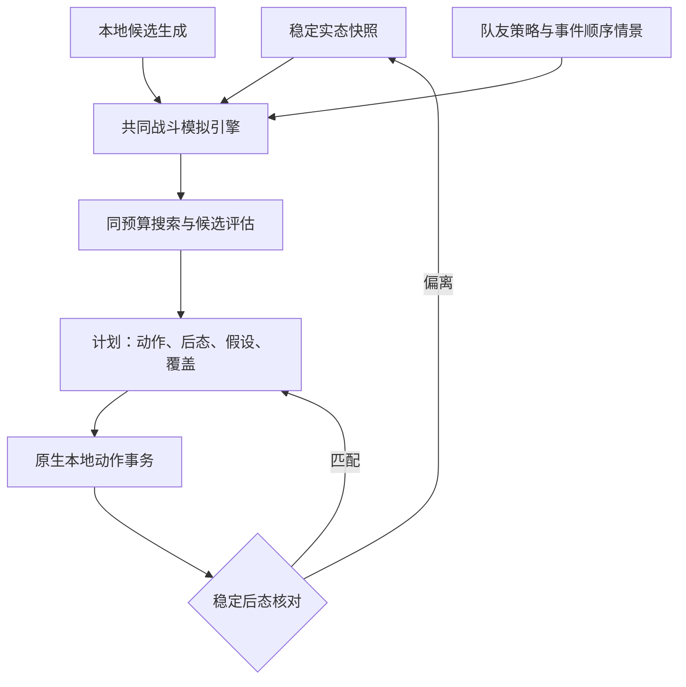

# CombatSolver：单多人共核、队友情景与执行校验改进计划

评估日期：2026-09-23。代码基线：`afc4fda136a190668fc6eefd33c061d8c2242c88`。
仓库：https://github.com/marinwd074/mysts2modtestforother

本文件是设计与执行任务书，不代表修改已经实现。核对了交接、Shadow planner、多人目标数学、最终排序、情景复评、Safe Execute policy/classifier 与 Deployment 的相关实现；没有做全仓审计、构建或实机性能测试。执行时必须先核对新 HEAD，以当前代码为准，禁止重复实现已完成阶段。

## 1. 决策结论

1. 单人与多人应共享模拟引擎、动作语义、Beam/Novelty 搜索基础、状态去重、Choice 驱动和计划表达。不要把单人强行迁移到当前多人特有的最坏情景排序和截断策略。
2. 把“多人 = 单人求解核心 + 队友行为环境模型 + 团队目标 + 同步适配”作为架构方向。队友因子必须进入状态转移，而不是只在分数上加一个预计伤害。
3. “和单人一样”应分开验收：相同语义覆盖、相同核心搜索能力、相同预算下的退化等价，以及真实多人局面的决策质量。队友未来不可控，不能承诺与确定性单人一样准确的整场路线。
4. Safe Execute 的有效边界要保留，但用统一动作事务与预测后态校验替代零散经验规则。世界变化首先是重新观察/规划的条件，不应一律变成错误或永久停机。
5. 优先建立因果对照、修执行校验，再修情景覆盖和风险排序，最后拓展本地/远端交错。不要同时改目标函数、搜索器、执行器。

## 2. 当前事实，禁止照旧计划重复施工

| 已核对内容 | 当前状态 | 含义 |
|---|---|---|
| 单多人完整搜索能力 | 交接记录 full-search heuristics 已共用，包含 Novelty、成长、遗物和长期收益 | 不能再把“多人完全没用单人算法”作为前提；执行时核对实际调用链 |
| 固定执行张数 | 生产路线不再被固定 6/32 张上限截断；32 常数仍为历史兼容保留 | 不应重复删除已经失效的限制，也不能仅因常数存在就断言仍生效 |
| 本地 Choice | 复用 NativeChoiceSession；不再因 choice_required 截断 | Choice 是真实选牌机制，不应删除；减少重复驱动和校验 |
| Shadow | 已可在不同队友间逐动作交错；精确状态去重与启发式保留已分开 | 还不等于本地玩家与队友完全交错 |
| Joint | 交接确认目前挂在本地 EndTurn 边界 | 本地易伤→队友攻击→本地后续行动仍需专门建模 |
| P3 | Aggressive/Defensive/Conserve/NoAction；最终前4组、每组最多4情景；只挑现存候选 | 不是每个候选都进行完整独立情景复演 |
| P3 排序 | 全情景存活、全情景胜利、最坏战损优先；概率路径关闭 | 更保守不是天然更优；压力情景不能当概率 |
| 多人专属牌 | 保留真实牌堆占位，排除自动出牌，预测出现 | 延续此用户规则 |
| 旧实机记录 | dd7f253 的 Offering 连续执行通过部分边界；PACT'S END 后 RemoteOrUnknownChange 并重搜 | 这是旧版本的观测，不能证明当前版本仍有同一故障，也不能证明变化真来自远端 |

## 3. 代码层面优先风险

### 3.1 本地动作归因不能依赖“别人没变”

`SolverController.Deployment.cs::BuildSafeActionRevalidationFacts` 当前将前后 RemotePublicFingerprint 相等作为事实；`MultiplayerSafeExecutePolicy.EnemyStateMatchesExpectedLocalAction` 要求敌人 ID 集合不变、有目标时非目标敌人 token 不变，无目标且集合相同时直接接受敌人变化。

由代码可确定这些检查不是完整预测后态比较；尚不能断言它们就是某个实机停顿的根因。需用真实日志或可执行模拟验证：

- 本地动作引发队友被动、连锁伤害、召唤/死亡移除，可能被误判成外部变化。
- 无目标动作实际造成错误数值，也可能通过局部结构检查。
- `LocalCardRemovedFromHand` 要求同一对象不在手牌；如果合法流程回手/重抽同一对象，可能误拒。先查 pinned 游戏语义，不能凭想象造特例。
- 能量/星数采用下界一致性而非精确预测；不能把此检查通过等同于预测正确。
- WorldVersion 是观察/过期令牌，不是“外部变化已发生”的数学证明。仍需保留提交前版本校验以避免使用过期局面。

处理原则：比较本地动作在完整预测态中的预期效果与稳定 live 后态；原生事件序列辅助归因。缺少事件或可读字段时标 Unknown，不能假定无变化。网络事件因果归属不完整时，实态重新捕获后重规划即可，无需编造归因。

### 3.2 情景覆盖必须对等

当前只从现存候选中选情景代表，且允许 NoAction + 另一情景形成可复评组。不同候选可能面对不同难度的情景，没搜到坏分支也不等于不存在坏分支。`ScenarioSetComplete` 仅是当前枚举没有被特定 Choice/深度条件截断，不代表穷尽队友未来。

新增明确区分：SearchCompleted、ScenarioCoverageComplete、TerminalReached、ProbabilityCalibrated。使用统一情景定义和时间范围；预算未完成记 Unknown，不计为存活、死亡或获胜。不让情景缺失给候选带来好处。

### 3.3 目标函数应核查而非直接全改

当前 P1 终局的连续 tempo 和中途 progress credit 不是同一数学问题的精确解，不能因共用类名就称其一致或可证明最优。一个可复核例子：InterimLossEquivalent 在固定 TeamLossRatio=0.1、EnemyDurabilityRatio=0.5 下，WorstPlayerLossRatio 从0.2增至0.4，得分由0.0925降至0.09125，低分更优。因此伤害向脆弱队员集中可能获得更多进度奖励。该例证明局部评分性质，不能独立证明最终出牌错误。

同时检查 CompleteVictory 先于 AllPlayersAlive 的比较顺序是否符合明确目标：本地幸存但队友死亡的胜利、全员存活未完成搜索、已证实失败，应分开定义，不能混为二值胜负。未完成搜索不能冒充更安全的完整胜利。

## 4. 推荐总架构

组件名是职责建议，先找现有等价实现，不要求照名字创建一堆类：

| 职责 | 内容 | 单人/多人差异 |
|---|---|---|
| CombatSnapshot | 玩家、敌人、牌堆、持续效果、RNG、历史和生命周期 | 参与者数量、可读数据，不另造引擎 |
| SearchCore | Beam、Novelty、动作选择、Fork、精确去重 | 共用；配置不同有清晰原因 |
| EnvironmentModel | 非本地动作、怪物、回合事件 | 单人无队友事件；多人注入队友策略与时序 |
| ObjectivePolicy | 累计战损、终局HP、存活、回合、资源 | 单人默认保持；团队目标单独配置 |
| ScenarioEvaluator | 同一本地决策的同场景比较 | 单人确定局面可退化为一个情景 |
| Plan | Forecast、ExecutablePrefix、ExpectedPostState、Assumptions 分离 | 预测到战斗结束不意味着获准连打到结束 |
| ActionExecutor | 原生出牌、Choice、完成等待、取消 | 共用驱动；多人加同步观察适配 |
| Reconciler | Continue / Wait / Replan / Stop | 共用结果语义，不用多人专属补丁层层叠加 |

三个信息键禁止混用：ExactStateKey（搜索未来等价）、ObservationRevision（并发过期判定）、PlanAssumptions（预测依赖）。哈希相等不等于已证明全游戏语义相等；精确声明必须限定到已建模字段，必要时验证规范化内容。

## 5. 数学方案

### 5.1 队友是状态转移因素

定义 s 为完整可建模状态，a 为本地动作，u 为队友动作，σ 为事件顺序，ξ 为随机事件：

`s_next = F(s, a, u, σ, ξ)`。

F 必须执行每张牌与触发器，而不是先合并成“队友本回合打30伤害”。易伤、击杀触发、共享RNG、抽牌、能量和目标改变都依赖顺序。读取到RNG状态不能消除未来动作顺序的不确定性。

可部署决策是策略 π(已观察历史)，不是一条预知未来的固定动作串。当前无法区分的情景必须选择相同当前动作；只有真实观察到差异后，后续动作才可分叉。不能每个情景挑一条不同的最佳完整路线再把这些分数平均。

初期固定本地第一动作/短前缀，并在明确观察边界后复用统一重规划策略。若先保持整个当前回合前缀，则明确这是受限策略族，不宣称代表全部可适应策略。

### 5.2 目标、风险、搜索启发分开

终局向量至少记录：玩家存活向量、累计HP损失、战后HP、最差玩家状态、遭遇的敌方行动轮数、药水/资源成本、长期收益。团队归一化分母冻结在根状态，并保存每名玩家原始值。累计损失不被治疗抹掉，治疗收益也不能消失。

默认迁移保留当前用户目标。可实验“战损容差内最快”：完整且满足生存条件的候选集合 C 中，先求 Lmin，再保留 L≤Lmin+δ，之后按回合数和既定资源规则选。δ以明确的HP或比例单位设置；不要擅自选5%为默认。

容差是候选集合筛选，不能写成 pairwise `|La-Lb|≤δ 就比较速度` 的排序器：可能出现不传递比较。中途Beam保留用显式启发式和多样性席位，不把尚未到终局的分数直接当精确战损下界。

### 5.3 名义表现与风险约束

当前 worst-case 是一种风险偏好，不是预测准确性的保证。建议实现可对照的策略：

- Nominal：明确标注假设的队友响应策略，优化合作收益。
- BoundedRisk（实验候选）：在指定短期压力情景中设置生存/额外损失约束，合格者按名义目标选。
- Robust：最坏情景优先，保留为可选策略和压力基线。

例如对同一情景集 Ω 和同一局部时间范围 H：`maxω Loss_H(π,ω) ≤ B`。B是明确配置的风险预算；初期若证据不足不替换默认。NoAction应区分“在下一观察窗口暂不出牌”与“整场战斗永远不出牌”，后者通常过于保守。若所有候选违反约束，报告不可满足并按明确的最小违规规则给出建议，不能静默扩大预算或伪装安全。

有真实行为校准数据后才考虑 E[L]+λCVaRα(L) 或机会约束。未校准时平均压力情景值只是工程指标，不能称作期望战损、胜率或置信度。完整联合最优只可在离线脚本环境中作为受限参考，不给队友执行权限。

## 6. Safe Execute 的统一事务

事务流程：等待稳定→绑定具体本地牌实例/目标→验证旧计划版本→提交一次原生动作→驱动本地Choice→等待该动作与连锁结算→捕获稳定后态→对照预期。

| 观察结果 | 处理 |
|---|---|
| 原生动作已完成，完整可比语义匹配预期 | Continue，复用剩余计划 |
| 动画/动作队列/Choice仍在处理中 | Wait；受取消和诊断超时控制，不提前判错 |
| 实态不同，状态合法且能重新建模 | Replan；废弃旧动作索引，从新根生成新计划 |
| 用户取消、战斗结束、授权结束 | Stop，正常完成/取消，不标为模拟Bug |
| 预测错误、无法支持的Choice、状态无法读取 | 分类报告；可建模则重搜，否则交回手动 |

维护不可复用的动作token和会话generation，防止旧异步回调恢复新会话。无法确认动作是否提交/完成时禁止自动重发同一张牌；先重新观察。多次重复语义状态且无进展才作为活锁信号，不用固定出牌数当防护。

初期语义偏离直接重搜，不做“只看下一张牌还能打就继续”。动作合法不等于路线仍好。后续若做局部修补，应在新快照上重放剩余前缀并重新评估；没有完整依赖证明不能忽略某个变化。

当前默认执行目标/牌型限制保持。允许本地牌作用于队友与允许操作队友是两个不同权限问题；未来支持前者必须有真实语义与原生目标验证，不在本轮顺带放开。结束回合也必须等原生全队条件满足，不能因本地预测EndTurn而在live端自行推进敌方。

## 7. GPT 分阶段执行卡

每轮只推进一张卡；如果已完成则提交证据并转到缺口，禁止重复造轮子。每阶段独立提交/开关回退，不依赖尚未完成的后续阶段。

### U0 — 建立当前差异图与最小质量基线

**状态（2026-09-23）：COMPLETE。** 当前差异图、五类问题分诊、四层诊断入口与固定输入见 [`U0_BASELINE.md`](U0_BASELINE.md)。除结构与 pinned production Search/replay 外，真实多人 request 8 已完成 `FINAL_CANDIDATE → FINAL_SELECTION → route_identity → native execution → U1_POST_STATE_COMPARE → MP2B_ACTION_RECONCILED` correlation，因此 U0 不再保留 Host/Client correlation 债务。卡牌专项执行问题归 U1。

读取 AGENTS.md、source/AGENTS.md、CODEX_HANDOFF.md，然后仅沿当前搜索/排序/执行调用链检查。输出：当前SHA、单人/多人差异表、每个差异的调用位置与目的、已失效兼容规则。

把“差”拆为：预测与真实不符、搜索没找到好路线、排序选错、执行误停/续打错误、重搜导致响应慢。每个问题必须标证据与待验证部分。

建立无队友事件的退化夹具，以及指定队友脚本的固定输入。退化等价测试必须排除多人敌人血量缩放、目标语义和团队目标不同等真实差异；不是拿不同游戏难度比。

验收：能记录模型转移、候选、最终选择、实际执行四层的独立结果；不要只报合同测试全绿。

### U1 — 先修动作后态校验

**状态（2026-09-24）：代码/合同/pinned production replay 已完成；真实 cancellation / late callback 已 PASS；卡牌专项与远端插入仍部分 `UNVERIFIED`。** 当前实现见 [`U1_ACTION_POSTSTATE.md`](U1_ACTION_POSTSTATE.md)：每张动作前 fresh probe；每张动作提交前由生产 `CombatBeamSolver.ReplayDiagnosticPrefix` 冻结 predicted `ContinuationStamp + remote fingerprint`；原生队列稳定后与 live 精确比较。旧 `local_card_removed/energy/enemy_target/remote_unchanged` 只保留旁路诊断。真实 request 10 已证明取消期间在途 native 动作不会恢复旧后缀；剩余重锤+Choice、连续 Offering/抽牌链仍是卡牌专项实机债务。真实队友插入的 ownership / WorldVersion / fresh-replan 验收已合并到 U6，不再重复维护一套 U1 smoke。

入口：MultiplayerSafeExecutePolicy、MultiplayerSafeLocalActionClassifier、SolverController.Deployment、现有native action/Choice与快照实现。

先加旁路的预期后态/实态差异记录，保留旧gate做对照；对复现的合法本地连锁误判写一个行为测试，再用共同模拟语义替换经验归因。沿用现有字段编码，禁止第二套手写卡牌效果。验证调用者的队列稳定等待，不把函数中的 ActionQueueIdle=true 单独当已证实缺陷。

验收：重锤+真实Choice链、连续祭品抽出后续牌、合法本地连锁变化可继续；真实远端插入导致旧计划失效后不再部署旧后缀；取消/迟到回调不会重复出牌。若游戏不支持某条假设，用真实等价效果替代，记录实际测试牌。

### U2 — 搜索共核与退化等价

**状态（2026-09-23）：COMPLETE。** 详细实现与证据见 [U2_SEARCH_KERNEL.md](U2_SEARCH_KERNEL.md)。SinglePlayerFullRoute 与 MultiplayerLocalCrossTurn 已共用完整搜索核；搜索能力与部署权限、route mechanics 与 team objective 分离。历史多人 Anger/current-turn/Shuffle 例外仅在实际多人根启用。pinned 0.107.1 的同根 differential 在相同 objective、DOP=1 与固定预算下实跑通过：首动作、完整 18-action 固定 tie-break 序列、终局值、score、expanded nodes 和 transitions 全部一致。真实多人 Joint/Shadow、MultiplayerOnly、网络/revalidation 与共享 RNG 边界均保留。

只消除有证据的单多人能力差异；保持单人默认目标和路线。队友模型先用确定性脚本；无队友事件时共用同一候选生成、预算和排序配置。

验收：相同抽象状态、相同动作集、相同目标与确定预算，首动作及终局值一致；平局允许等价路线，固定tie-break时再要求相同序列。禁止为了测试通过删除真实多人语义。

### U3 — 公平情景复演与非预知决策

**状态（2026-09-23）：COMPLETE。** 代码/合同/pinned 0.107.1 构建、真实双玩家 Matrix runtime、真实双玩家 Timeout fail-closed runtime 均已 PASS。 source `3c990c61fa90343f7e4385cd2d490019553f7c89` 已实现固定四 ScenarioSpec、公平完整覆盖、Completed/Terminal/Unknown、非预知 CurrentTurnDecisionKey、从原 MaxExpandedNodes 预留的 bounded 复评预算、TimeLimit fail-closed 与真实 replay work 计数。compatibility run `35878443605`、pinned run `35878443497` 均 SUCCESS；U2 degenerate 继续 PASS。2026-09-23 的真实 Host/Client `RUBY_RAIDERS_NORMAL` 问题包又观察到 5 轮完整 U3 Matrix，均满足 4 decisions × 4 ScenarioSpec、总预算守恒、replay work 对账和完整 coverage→rerank 一致，因此 Matrix 记 PASS。详细证据与剩余 Timeout smoke 见 [U3_FAIR_SCENARIO_REEVALUATION.md](U3_FAIR_SCENARIO_REEVALUATION.md)。真实双玩家 Matrix 与 TimeLimit fail-closed smoke 均已完成；U3 已收口。U4 风险与目标 A/B 随后也已完成，当前下一张卡为 U5。

入口：FinalPlanOrdering、MultiplayerScenarioReevaluationPolicy、ShadowTeammateScenarioPolicy、CurrentTurnDecisionKey。

对少量候选建立同一ScenarioSpec集合；ScenarioSpec是会随状态响应的行为规则/事件调度，而不是强行重放在别的候选下可能已非法的牌串。分配独立的有限复评预算并计入总预算，禁止偷偷增加总算力。

先固定同一当前决策；后续分叉只在观察边界允许。记录每候选×情景的 Completed/Unknown/Terminal 和真实展开开销。若不能覆盖，使用对全部候选一致的预先定义fallback并报告，不能让漏评候选获利。

验收：改变候选枚举顺序不会因缺失情景改变比较含义；设计“只有预知队友选择才能获利”的反例，确认不会选择不可实现的组合；预算中断不伪装全情景胜利。

### U4 — 风险与目标 A/B

**状态（2026-09-23）：COMPLETE。** U4 已验证并修正 interim-risk 反例：旧中途 progress credit 会随 `WorstPlayerLossRatio` 增大，使同团队总战损、同敌方进度时“伤害更集中到单个脆弱队员”的状态反而获得更低 loss-equivalent。当前中途进度启发固定使用健康基线风险因子 `0.5`，而终局 `ContinuousTempoScore` 仍保留风险定价；`WorstPlayerLossRatio` 继续作为独立后续排序键。真实多人 Beam 的 `BuildMultiplayerObjectiveRank → MultiplayerCombatObjectiveMath.BuildRank/Compare` 直接消费该 interim 结果，因此修正作用于实际 Beam 保留；单人排序路径未改。

现有 U3 四情景 Matrix 只计算一次，然后在**同一 Matrix、同一预算、额外 replay=0** 的条件下并行报告三种风险解释：`Robust` 完全复用当前生产 comparator；`NominalReference` 使用四个压力情景的等权均值，只是参考值，不冒充概率期望；`BoundedRisk` 实验标尺为 `mean + 0.5 × (worst - mean)`。生产诊断新增 `MP_U4_STRATEGY_RESULT` / `MP_U4_STRATEGY_AB`，但正式 final selection 仍固定使用 Robust。行为 prior 尚未校准，旧 U3 实机 Matrix 又早于 U4 指标，因此没有足够真实质量证据支持默认迁移；按本计划要求保持旧默认，也不声称任一方案“数学上最优”。

容差目标保持为独立实验：`SelectNominalToleranceExperimentIndex` 只接受调用方显式 tolerance，先守住全员存活/终局完整性硬边界，再在 nominal loss 容差集合内比较 worst loss；生产没有调用它，也没有设置默认容差，避免与 BoundedRisk 同时改目标。

排序含义已经明确分层：单个 outcome 仍为完整胜利 → 全员存活 → loss-equivalent → 最差队员累计战损 → 团队累计战损 → 结束回合/敌方耐久；Scenario 层先要求所有情景全员存活，再看全情景胜利，随后才由 Robust/NominalReference/BoundedRisk 解释损失风险。团队剩余 HP 与最差队员剩余 HP 作为独立 U4 遥测报告，不偷偷加入排序，避免把“风险策略 A/B”和“新增目标权重”混成一次改动。

`NoAction` 已显式定义为 **current Joint forecast window only**：只表示本次 Joint 预测窗口内队友不出牌，不代表队友在剩余整场战斗长期不行动。U4 同时报告合作情景相对 NoAction 的团队战损收益与敌方耐久推进收益，以及 nominal/robust 差距、平均/最坏团队战损、团队/最差队员剩余 HP。

验证：interim 脆弱性、三策略不同赢家、同 Matrix selector、独立 tolerance、合作收益、最终 HP 与 NoAction scope 均进入 `MultiplayerLocalCrossTurnChecks`；compatibility run `35886546305` SUCCESS，pinned 0.107.1 run `35886546204` SUCCESS，后者通过 CombatSolver Release、U0/U1 production replay、U2 degenerate equivalence、P0/P1 pinned runtime 与历史 P0 A/B 分类。U4 已收口，下一张卡进入 U5。

### U5 — 本地与队友的关键顺序

**状态（2026-09-23）：COMPLETE（代码/合同/pinned 0.107.1 回归完成；真实 Host/Client U5 专项 smoke 仍 `UNVERIFIED`）。** 详细实现与证据见 [U5_LOCAL_TEAMMATE_INTERLEAVING.md](U5_LOCAL_TEAMMATE_INTERLEAVING.md)。多人本地搜索现在可形成“本地 A → forecast-only 队友 B → 从 B 后真实模拟状态继续本地 C”；B 始终只存在于 detached simulator，不获得部署权限。A→B 前向路线与 B→A reverse-order probe 都逐动作走生产 F；reverse 顺序若导致牌身份、合法性、目标、牌堆/RNG/History/死亡处理等变化，会标为 `OrderSensitive` 或 `ReverseUnavailable`。只有两顺序的 `ShadowFutureStateFingerprint` 完全相同才允许 `ExactEquivalent` collapse；仅“不同怪物”不构成可交换证明。

调度保持有界：每个本地回合最多一个 teammate forecast observation、每个观察最多保留 4 条路线；`AllowsProactiveWaitForTeammate=false`，没有“等待理想队友行动”的无限等待动作。真实部署在 forecast observation 前截断；Safe Auto 保持 fresh-search 资格并重新观察/规划，绝不会跳过 forecast 节点继续部署条件后缀。U3 当前决策身份和情景复评同样在 forecast 边界 fail closed，避免预知队友选择。

验证：compatibility run `35890994702` SUCCESS；原 pinned 0.107.1 run `35890656903` SUCCESS。随后补充 U5 非实机生产 replay：compatibility `35892680315` SUCCESS，pinned 0.107.1 `35892680392` SUCCESS。在固定 0.107.1 场景中，生产 replay 的 `BASH→STRIKE_IRONCLAD` 得到 enemy HP 39 / fingerprint `7D7857814B038E3D:4A6951B304DF0382`，反向 `STRIKE_IRONCLAD→BASH` 得到 enemy HP 42 / fingerprint `93D0F278205774EB:8DB470E2DA385E5E`，确认 Vulnerable/attack 顺序敏感且不能 exact collapse；同一 pinned run 完整通过 Release、U0/U1、U2、P0/P1 runtime 与历史 P0 A/B 分类。 随后再补终局顺序反例：compatibility `35893826085` SUCCESS，pinned `35893825974` SUCCESS；敌人 HP=7 时 `BASH→STRIKE` 在 Bash 结束战斗后拒绝第二动作（`TerminalForwardRejected=true`），而 `STRIKE→BASH` 合法完成并得到 enemy HP 0 / energy 0（`TerminalReverseCompleted=true`），确认提前终局造成的顺序合法性不对称不会被折叠。随后共享生成 RNG 反例也已非实机 PASS：compatibility `35935837095`、pinned `35935837066` 均 SUCCESS；生产 replay 的 `INFERNAL_BLADE→DISTRACTION` 生成 `DISMANTLE + TRUE_GRIT`，反向生成 `PRIMAL_FORCE + UNRELENTING`，两者完整 future fingerprint 分别为 `5EB1604F1125EBD8:7D84CF916EF7DFAB` / `C1076280507FB268:9AC9FCA14C304F1F`，最终手牌 multiset 不同，确认共同 `CombatCardGeneration` RNG 与牌堆后态保留顺序影响。 随后资源顺序反例也已非实机 PASS：compatibility `35936767527`、pinned `35936767565` 均 SUCCESS；根能量=1 时 `OFFERING→BASH` 由 Offering 先改变资源后合法完成并最终 energy=1，而 `BASH→OFFERING` 在第一动作即被生产 replay 以 `energy=1 cost=2` 拒绝，确认资源状态改变导致的动作合法性顺序依赖不会被折叠。 随后抽牌/牌堆顺序反例也已非实机 PASS：compatibility `35937892578`、pinned `35937892644` 均 SUCCESS；固定根顶部 `DEFEND_IRONCLAD, STRIKE_IRONCLAD` 下，`POMMEL_STRIKE→HAVOC` 使 Defend 留手 / Strike 进 Exhaust，而反向使 Strike 留手 / Defend 进 Exhaust，完整 future fingerprint 分别为 `D0C9E5CB263AF5ED:1427A63872339424` / `D79C9EEBE1B22A1F:B06C41B99F93102B`，确认抽牌改变牌堆顶与后续自动出牌对象的顺序影响。没有扩大 Beam、节点或时间预算。该证据仍是 detached 单进程模拟，`RealMultiplayerOwnershipVerified=false`；Vulnerable/attack、提前终局、共享生成 RNG、资源合法性、抽牌/牌堆顶变化五类顺序语义已由 pinned production replay 覆盖；U6 的 U5 最小实机债务收缩为真实远端动作插入后的 ownership / WorldVersion / observation→fresh-replan 链，不由离线 replay 冒充实机 PASS。下一张卡为 U6。

### U6 — 实机闭环与清理

**状态（2026-09-24）：IN PROGRESS。** 生产清理已开始：固定 Safe Execute 6/32-action ceiling 不再作为 capability；零生产调用的 `MaxActionsPerDeployment`、旧 MP-2A 单牌切片和 MP-2C ceiling reason 已从生产代码删除，能力日志改为 `action_limit=route_bounded`，具体有限 `max_actions` 只在每次授权 route 的 `MP2B_DEPLOY_START` 给出。历史 validator 仍可读取旧证据，但生产代码不再为它们保留假边界。当前交接已压缩为“当前架构 / 已验证 / 未验证 / 下一步”。

新增 `tools/multiplayer-lab/validate-u6-runtime-closure.ps1`：一次真实 Host/Client 远端插入即可同时验收 U1/U5 的剩余公共债务。合法路径可以是 post-action `remote_match=false`，也可以是下一动作 pre-action probe 发现 WorldVersion 变化；两者都必须证明旧 request 不再提交下一张 native action、所有已提交动作仍归本地 `local_net_id`、且随后 fresh search。

旧 `P0HistoricalPinnedHarness` 与历史 MP2A/MP2B validator 目前仍被 workflow/contract suite 引用，因此不满足“旧路径调用为零”条件，暂不删除。小规模对照通过后再评估本地精确斩杀、缓存、增量修补和更远期预测。

验收：交接只保留当前架构、已验证结果、未验证事项和下一任务；旧路径调用为零才能删除；最终必须把 compatibility / pinned 构建与真实 Host/Client 证据分层报告，不能用 synthetic validator 冒充实机 PASS。

## 8. 最小验证矩阵与停止条件

| 样例 | 针对问题 | 必须观察 |
|---|---|---|
| 等价单人/无队友事件 | 共核回归 | 候选、首动作、终局值 |
| 本地重锤+Choice+后续牌 | 错误截断 | Choice完成、后态、后缀 |
| 双祭品/抽牌生成链 | 使用未来手牌 | 每步真实牌身份、资源 |
| 本地连锁影响他人/多目标 | 归因误判 | 预期diff与实际diff |
| 队友在两次本地动作间行动 | 过期后缀 | 旧generation被拒、新根重算 |
| 短期NoAction与正常合作 | 过度保守 | 名义损失、压力损失、结束轮数 |
| 相同候选不同情景覆盖 | 排序偏差 | coverage矩阵、Unknown处理 |
| 易伤/攻击、共享RNG换序 | 调度语义 | 两顺序的完整后态 |
| 提交后取消/迟到回调 | 重复动作 | 单次提交、无旧会话复活 |

只针对本阶段涉及项运行；编译一次、相关行为测试一次，有具体失败才扩展。最终默认迁移前集中做有限代表性实机验证。缺游戏DLL/双端运行环境时记录 UNVERIFIED 和最小补测步骤，不拿字符串扫描或合同测试冒充实机验证。

公平预算：同时记录固定节点/转移次数（可重现）与端到端时间（体验），将Shadow、复评、Fork、指纹、重播全部计入。记录首次结果时间、总耗时、内存、战损、队员死亡、结束轮数、误停数、重规划数。重规划数越少不一定越好：应区分必要重规划与错误失效。

达到阶段验收后停止扩大测试。任何基线改变必须写明原因，不能扩大Beam/时间后声称算法更优。

## 9. 可直接交给 GPT 的总提示词

> 请以当前仓库HEAD为准实施本文件，每次只完成一张执行卡。先读AGENTS和当前handoff，核对已实现部分；本文件中的类型名是职责建议，优先复用现有实现。我的目标是保留单人求解质量，使多人共享同一求解核心，将队友行为建模为状态转移与不确定情景，并减少错误执行边界。
>
> 首轮完成U0；若U0已有等价证据，则只补缺口后推进U1。修改前给出“实测症状—代码原因或假设—最小变更—验收方法”四项。不要根据类名、文档、测试全绿推断运行正确。不要一次重写搜索器、目标和执行器，不扩大预算掩盖问题，不新增第二套卡牌模拟。多人专属牌继续保留牌堆占位但不主动推荐或执行；只部署本地动作。
>
> 明确区分搜索结果、预测假设与本次可执行前缀。动作完成后优先按共同模型的预期后态核对；真实变化导致重规划是正常流程，但不得重复提交不确定是否已执行的动作。单人默认行为保持，实验策略先可回退对照。多情景必须同场景、同预算、当前决策一致，缺失标Unknown，不能宣称保证胜利或真实概率。
>
> 每轮结束只报告：当前SHA、修改文件/函数、修复原因、运行过的测试与结果、未验证风险、下一张卡。没有实机条件就列最小补测，不反复扩大静态测试。完成验收即停止本轮，并更新简短handoff。

## 10. 核对来源

- [当前交接](https://github.com/marinwd074/mysts2modtestforother/blob/afc4fda136a190668fc6eefd33c061d8c2242c88/source/docs/CODEX_HANDOFF.md)
- [执行规则](https://github.com/marinwd074/mysts2modtestforother/blob/afc4fda136a190668fc6eefd33c061d8c2242c88/source/src/Runtime/MultiplayerSafeExecutePolicy.cs)
- [执行主链](https://github.com/marinwd074/mysts2modtestforother/blob/afc4fda136a190668fc6eefd33c061d8c2242c88/source/src/Runtime/SolverController.Deployment.cs)
- [多人目标数学](https://github.com/marinwd074/mysts2modtestforother/blob/afc4fda136a190668fc6eefd33c061d8c2242c88/source/src/Search/MultiplayerCombatObjectiveMath.cs)
- [P3设计](https://github.com/marinwd074/mysts2modtestforother/blob/afc4fda136a190668fc6eefd33c061d8c2242c88/source/docs/P3_MULTIPLAYER_JOINT_DECISION.md)
- [情景排序](https://github.com/marinwd074/mysts2modtestforother/blob/afc4fda136a190668fc6eefd33c061d8c2242c88/source/src/Search/MultiplayerScenarioReevaluationPolicy.cs)
- [ISMCTS论文原文](https://eprints.whiterose.ac.uk/id/eprint/75048/1/CowlingPowleyWhitehouse2012.pdf)：信息集与策略融合是本方案非预知约束的理论参考，不代表建议把Beam整体换成ISMCTS。