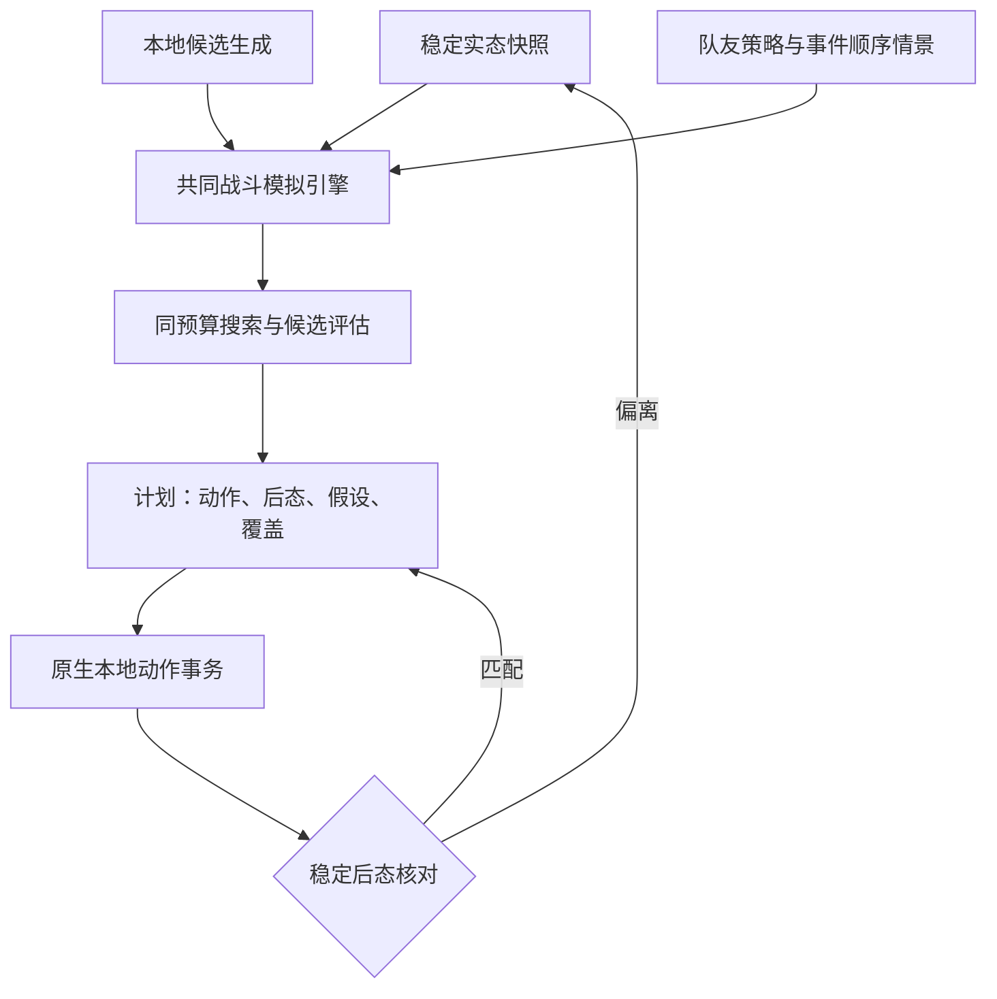
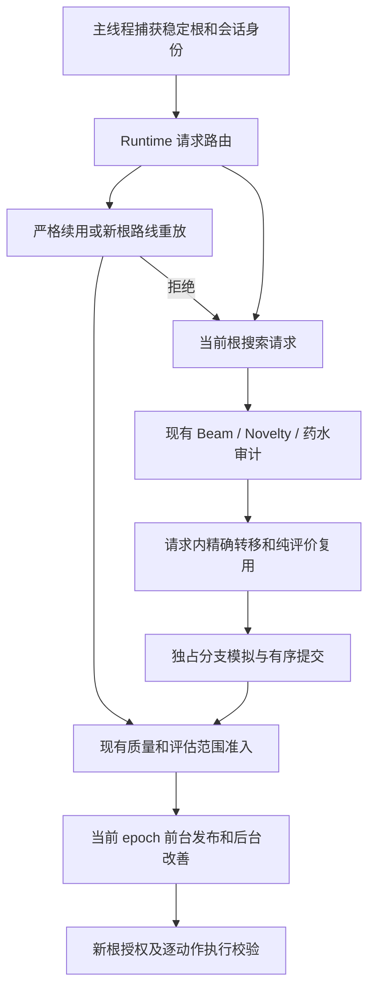

# CombatSolver：单多人共核、队友情景与执行校验改进计划

评估日期：2026-09-23。代码基线：`afc4fda136a190668fc6eefd33c061d8c2242c88`。
仓库：https://github.com/marinwd074/mysts2modtestforother

新增任务见 [§11 多人战前预计算与 Boss 通关优先](#11-多人战前预计算与-boss-通关优先2026-09-30)，按其独立阶段推进，不重开已完成的 U0–U6。

后续性能方案见 [§12 多人搜索加速](#12-多人搜索加速2026-10-01)；S2 首版实验已实现且默认关闭，其余保持计划。

本文件是设计与执行任务书，不代表修改已经实现。核对了交接、Shadow planner、多人目标数学、最终排序、情景复评、Safe Execute policy/classifier 与 Deployment 的相关实现；没有做全仓审计、构建或实机性能测试。执行时必须先核对新 HEAD，以当前代码为准，禁止重复实现已完成阶段。

## 1. 决策结论

1. 单人与多人应共享模拟引擎、动作语义、Beam/Novelty 搜索基础、状态去重、Choice 驱动和计划表达。不要把单人强行迁移到当前多人特有的最坏情景排序和截断策略。
2. 把“多人 = 单人求解核心 + 队友行为环境模型 + 团队目标 + 同步适配”作为架构方向。队友因子必须进入状态转移，而不是只在分数上加一个预计伤害。
3. “和单人一样”应分开验收：相同语义覆盖、相同核心搜索能力、相同预算下的退化等价，以及真实多人局面的决策质量。队友未来不可控，不能承诺与确定性单人一样准确的整场路线。
4. Safe Execute 的有效边界要保留，但用统一动作事务与预测后态校验替代零散经验规则。世界变化首先是重新观察/规划的条件，不应一律变成错误或永久停机。
5. 优先建立因果对照、修执行校验，再修情景覆盖和风险排序，最后拓展本地/远端交错。不要同时改目标函数、搜索器、执行器。

## 2. 当前事实，禁止照旧计划重复施工

| 已核对内容 | 当前状态 | 含义 |
|---|---|---|
| 单多人完整搜索能力 | 交接记录 full-search heuristics 已共用，包含 Novelty、成长、遗物和长期收益 | 不能再把“多人完全没用单人算法”作为前提；执行时核对实际调用链 |
| 固定执行张数 | U6 已删除固定 6/32 张生产上限与旧 MP-2A 单动作兼容入口；Safe Execute session 容量来自本次有限 selected route | 不再恢复任意固定 action ceiling；逐动作后态校验仍是实际边界 |
| 本地 Choice | 复用 NativeChoiceSession；不再因 choice_required 截断 | Choice 是真实选牌机制，不应删除；减少重复驱动和校验 |
| Shadow | 已可在不同队友间逐动作交错；精确状态去重与启发式保留已分开 | 还不等于本地玩家与队友完全交错 |
| Joint | 交接确认目前挂在本地 EndTurn 边界 | 本地易伤→队友攻击→本地后续行动仍需专门建模 |
| P3 | Aggressive/Defensive/Conserve/NoAction；最终前4组、每组最多4情景；只挑现存候选 | 不是每个候选都进行完整独立情景复演 |
| P3 排序 | 全情景存活、全情景胜利、最坏战损优先；概率路径关闭 | 更保守不是天然更优；压力情景不能当概率 |
| 多人专属牌 | 保留真实牌堆占位，排除自动出牌，预测出现 | 延续此用户规则 |
| 旧实机记录 | dd7f253 的 Offering 连续执行通过部分边界；PACT'S END 后 RemoteOrUnknownChange 并重搜 | 这是旧版本的观测，不能证明当前版本仍有同一故障，也不能证明变化真来自远端 |

## 3. 代码层面优先风险

### 3.1 本地动作归因不能依赖“别人没变”

`SolverController.Deployment.cs::BuildSafeActionRevalidationFacts` 当前将前后 RemotePublicFingerprint 相等作为事实；`MultiplayerSafeExecutePolicy.EnemyStateMatchesExpectedLocalAction` 要求敌人 ID 集合不变、有目标时非目标敌人 token 不变，无目标且集合相同时直接接受敌人变化。

由代码可确定这些检查不是完整预测后态比较；尚不能断言它们就是某个实机停顿的根因。需用真实日志或可执行模拟验证：

- 本地动作引发队友被动、连锁伤害、召唤/死亡移除，可能被误判成外部变化。
- 无目标动作实际造成错误数值，也可能通过局部结构检查。
- `LocalCardRemovedFromHand` 要求同一对象不在手牌；如果合法流程回手/重抽同一对象，可能误拒。先查 pinned 游戏语义，不能凭想象造特例。
- 能量/星数采用下界一致性而非精确预测；不能把此检查通过等同于预测正确。
- WorldVersion 是观察/过期令牌，不是“外部变化已发生”的数学证明。仍需保留提交前版本校验以避免使用过期局面。

处理原则：比较本地动作在完整预测态中的预期效果与稳定 live 后态；原生事件序列辅助归因。缺少事件或可读字段时标 Unknown，不能假定无变化。网络事件因果归属不完整时，实态重新捕获后重规划即可，无需编造归因。

### 3.2 情景覆盖必须对等

当前只从现存候选中选情景代表，且允许 NoAction + 另一情景形成可复评组。不同候选可能面对不同难度的情景，没搜到坏分支也不等于不存在坏分支。`ScenarioSetComplete` 仅是当前枚举没有被特定 Choice/深度条件截断，不代表穷尽队友未来。

新增明确区分：SearchCompleted、ScenarioCoverageComplete、TerminalReached、ProbabilityCalibrated。使用统一情景定义和时间范围；预算未完成记 Unknown，不计为存活、死亡或获胜。不让情景缺失给候选带来好处。

### 3.3 目标函数应核查而非直接全改

当前 P1 终局的连续 tempo 和中途 progress credit 不是同一数学问题的精确解，不能因共用类名就称其一致或可证明最优。一个可复核例子：InterimLossEquivalent 在固定 TeamLossRatio=0.1、EnemyDurabilityRatio=0.5 下，WorstPlayerLossRatio 从0.2增至0.4，得分由0.0925降至0.09125，低分更优。因此伤害向脆弱队员集中可能获得更多进度奖励。该例证明局部评分性质，不能独立证明最终出牌错误。

同时检查 CompleteVictory 先于 AllPlayersAlive 的比较顺序是否符合明确目标：本地幸存但队友死亡的胜利、全员存活未完成搜索、已证实失败，应分开定义，不能混为二值胜负。未完成搜索不能冒充更安全的完整胜利。

## 4. 推荐总架构

```mermaid
flowchart TD
    A["稳定实态快照"] --> B["共同战斗模拟引擎"]
    C["本地候选生成"] --> B
    D["队友策略与事件顺序情景"] --> B
    B --> E["同预算搜索与候选评估"]
    E --> F["计划：动作、后态、假设、覆盖"]
    F --> G["原生本地动作事务"]
    G --> H{"稳定后态核对"}
    H -->|"匹配"| F
    H -->|"偏离"| A
```

组件名是职责建议，先找现有等价实现，不要求照名字创建一堆类：

| 职责 | 内容 | 单人/多人差异 |
|---|---|---|
| CombatSnapshot | 玩家、敌人、牌堆、持续效果、RNG、历史和生命周期 | 参与者数量、可读数据，不另造引擎 |
| SearchCore | Beam、Novelty、动作选择、Fork、精确去重 | 共用；配置不同有清晰原因 |
| EnvironmentModel | 非本地动作、怪物、回合事件 | 单人无队友事件；多人注入队友策略与时序 |
| ObjectivePolicy | 累计战损、终局HP、存活、回合、资源 | 单人默认保持；团队目标单独配置 |
| ScenarioEvaluator | 同一本地决策的同场景比较 | 单人确定局面可退化为一个情景 |
| Plan | Forecast、ExecutablePrefix、ExpectedPostState、Assumptions 分离 | 预测到战斗结束不意味着获准连打到结束 |
| ActionExecutor | 原生出牌、Choice、完成等待、取消 | 共用驱动；多人加同步观察适配 |
| Reconciler | Continue / Wait / Replan / Stop | 共用结果语义，不用多人专属补丁层层叠加 |

三个信息键禁止混用：ExactStateKey（搜索未来等价）、ObservationRevision（并发过期判定）、PlanAssumptions（预测依赖）。哈希相等不等于已证明全游戏语义相等；精确声明必须限定到已建模字段，必要时验证规范化内容。

## 5. 数学方案

### 5.1 队友是状态转移因素

定义 s 为完整可建模状态，a 为本地动作，u 为队友动作，σ 为事件顺序，ξ 为随机事件：

`s_next = F(s, a, u, σ, ξ)`。

F 必须执行每张牌与触发器，而不是先合并成“队友本回合打30伤害”。易伤、击杀触发、共享RNG、抽牌、能量和目标改变都依赖顺序。读取到RNG状态不能消除未来动作顺序的不确定性。

可部署决策是策略 π(已观察历史)，不是一条预知未来的固定动作串。当前无法区分的情景必须选择相同当前动作；只有真实观察到差异后，后续动作才可分叉。不能每个情景挑一条不同的最佳完整路线再把这些分数平均。

初期固定本地第一动作/短前缀，并在明确观察边界后复用统一重规划策略。若先保持整个当前回合前缀，则明确这是受限策略族，不宣称代表全部可适应策略。

### 5.2 目标、风险、搜索启发分开

终局向量至少记录：玩家存活向量、累计HP损失、战后HP、最差玩家状态、遭遇的敌方行动轮数、药水/资源成本、长期收益。团队归一化分母冻结在根状态，并保存每名玩家原始值。累计损失不被治疗抹掉，治疗收益也不能消失。

默认迁移保留当前用户目标。可实验“战损容差内最快”：完整且满足生存条件的候选集合 C 中，先求 Lmin，再保留 L≤Lmin+δ，之后按回合数和既定资源规则选。δ以明确的HP或比例单位设置；不要擅自选5%为默认。

容差是候选集合筛选，不能写成 pairwise `|La-Lb|≤δ 就比较速度` 的排序器：可能出现不传递比较。中途Beam保留用显式启发式和多样性席位，不把尚未到终局的分数直接当精确战损下界。

### 5.3 名义表现与风险约束

当前 worst-case 是一种风险偏好，不是预测准确性的保证。建议实现可对照的策略：

- Nominal：明确标注假设的队友响应策略，优化合作收益。
- BoundedRisk（实验候选）：在指定短期压力情景中设置生存/额外损失约束，合格者按名义目标选。
- Robust：最坏情景优先，保留为可选策略和压力基线。

例如对同一情景集 Ω 和同一局部时间范围 H：`maxω Loss_H(π,ω) ≤ B`。B是明确配置的风险预算；初期若证据不足不替换默认。NoAction应区分“在下一观察窗口暂不出牌”与“整场战斗永远不出牌”，后者通常过于保守。若所有候选违反约束，报告不可满足并按明确的最小违规规则给出建议，不能静默扩大预算或伪装安全。

有真实行为校准数据后才考虑 E[L]+λCVaRα(L) 或机会约束。未校准时平均压力情景值只是工程指标，不能称作期望战损、胜率或置信度。完整联合最优只可在离线脚本环境中作为受限参考，不给队友执行权限。

## 6. Safe Execute 的统一事务

事务流程：等待稳定→绑定具体本地牌实例/目标→验证旧计划版本→提交一次原生动作→驱动本地Choice→等待该动作与连锁结算→捕获稳定后态→对照预期。

| 观察结果 | 处理 |
|---|---|
| 原生动作已完成，完整可比语义匹配预期 | Continue，复用剩余计划 |
| 动画/动作队列/Choice仍在处理中 | Wait；受取消和诊断超时控制，不提前判错 |
| 实态不同，状态合法且能重新建模 | Replan；废弃旧动作索引，从新根生成新计划 |
| 用户取消、战斗结束、授权结束 | Stop，正常完成/取消，不标为模拟Bug |
| 预测错误、无法支持的Choice、状态无法读取 | 分类报告；可建模则重搜，否则交回手动 |

维护不可复用的动作token和会话generation，防止旧异步回调恢复新会话。无法确认动作是否提交/完成时禁止自动重发同一张牌；先重新观察。多次重复语义状态且无进展才作为活锁信号，不用固定出牌数当防护。

初期语义偏离直接重搜，不做“只看下一张牌还能打就继续”。动作合法不等于路线仍好。后续若做局部修补，应在新快照上重放剩余前缀并重新评估；没有完整依赖证明不能忽略某个变化。

当前默认执行目标/牌型限制保持。允许本地牌作用于队友与允许操作队友是两个不同权限问题；未来支持前者必须有真实语义与原生目标验证，不在本轮顺带放开。结束回合也必须等原生全队条件满足，不能因本地预测EndTurn而在live端自行推进敌方。

## 7. GPT 分阶段执行卡

每轮只推进一张卡；如果已完成则提交证据并转到缺口，禁止重复造轮子。每阶段独立提交/开关回退，不依赖尚未完成的后续阶段。

### U0 — 建立当前差异图与最小质量基线

**状态（2026-09-23）：结构性验收已完成。** 当前差异图、五类问题分诊、四层诊断入口与固定输入见 Git history 中的 U0 完成记录。真实 Release / SP / Host+Client 行为样例仍按证据标为 `UNVERIFIED`，不由结构门禁冒充运行 PASS。下一张卡为 U1；不要在 U0 内继续扩大搜索/排序改动。

读取 AGENTS.md、source/AGENTS.md、CODEX_HANDOFF.md，然后仅沿当前搜索/排序/执行调用链检查。输出：当前SHA、单人/多人差异表、每个差异的调用位置与目的、已失效兼容规则。

把“差”拆为：预测与真实不符、搜索没找到好路线、排序选错、执行误停/续打错误、重搜导致响应慢。每个问题必须标证据与待验证部分。

建立无队友事件的退化夹具，以及指定队友脚本的固定输入。退化等价测试必须排除多人敌人血量缩放、目标语义和团队目标不同等真实差异；不是拿不同游戏难度比。

验收：能记录模型转移、候选、最终选择、实际执行四层的独立结果；不要只报合同测试全绿。

### U1 — 先修动作后态校验

**状态（2026-09-23）：代码/合同/Release 构建已完成，真实多人验收仍 `UNVERIFIED`。** 当前实现见 Git history 中的 U1 完成记录：每张动作前 fresh probe；每张动作提交前由生产 `CombatBeamSolver.ReplayDiagnosticPrefix` 冻结 predicted `ContinuationStamp + remote fingerprint`；原生队列稳定后与 live 精确比较。旧 `local_card_removed/energy/enemy_target/remote_unchanged` 只保留旁路诊断。重锤+Choice、连续祭品、真实队友插入和 cancellation 双端 timing 仍需实机复测；该 runtime debt 与已完成的 U2 搜索共核验收分开记录。

入口：MultiplayerSafeExecutePolicy、MultiplayerSafeLocalActionClassifier、SolverController.Deployment、现有native action/Choice与快照实现。

先加旁路的预期后态/实态差异记录，保留旧gate做对照；对复现的合法本地连锁误判写一个行为测试，再用共同模拟语义替换经验归因。沿用现有字段编码，禁止第二套手写卡牌效果。验证调用者的队列稳定等待，不把函数中的 ActionQueueIdle=true 单独当已证实缺陷。

验收：重锤+真实Choice链、连续祭品抽出后续牌、合法本地连锁变化可继续；真实远端插入导致旧计划失效后不再部署旧后缀；取消/迟到回调不会重复出牌。若游戏不支持某条假设，用真实等价效果替代，记录实际测试牌。

### U2 — 搜索共核与退化等价

**状态（2026-09-23）：COMPLETE。** 详细实现与证据见 Git history 中的 U2 完成记录。SinglePlayerFullRoute 与 MultiplayerLocalCrossTurn 已共用完整搜索核；搜索能力与部署权限、route mechanics 与 team objective 分离。历史多人 Anger/current-turn/Shuffle 例外仅在实际多人根启用。pinned 0.107.1 的同根 differential 在相同 objective、DOP=1 与固定预算下实跑通过：首动作、完整 18-action 固定 tie-break 序列、终局值、score、expanded nodes 和 transitions 全部一致。真实多人 Joint/Shadow、MultiplayerOnly、网络/revalidation 与共享 RNG 边界均保留。

只消除有证据的单多人能力差异；保持单人默认目标和路线。队友模型先用确定性脚本；无队友事件时共用同一候选生成、预算和排序配置。

验收：相同抽象状态、相同动作集、相同目标与确定预算，首动作及终局值一致；平局允许等价路线，固定tie-break时再要求相同序列。禁止为了测试通过删除真实多人语义。

### U3 — 公平情景复演与非预知决策

**状态（2026-09-23）：COMPLETE。** 代码/合同/pinned 0.107.1 构建、真实双玩家 Matrix runtime、真实双玩家 Timeout fail-closed runtime 均已 PASS。 source `3c990c61fa90343f7e4385cd2d490019553f7c89` 已实现固定四 ScenarioSpec、公平完整覆盖、Completed/Terminal/Unknown、非预知 CurrentTurnDecisionKey、从原 MaxExpandedNodes 预留的 bounded 复评预算、TimeLimit fail-closed 与真实 replay work 计数。compatibility run `35878443605`、pinned run `35878443497` 均 SUCCESS；U2 degenerate 继续 PASS。2026-09-23 的真实 Host/Client `RUBY_RAIDERS_NORMAL` 问题包又观察到 5 轮完整 U3 Matrix，均满足 4 decisions × 4 ScenarioSpec、总预算守恒、replay work 对账和完整 coverage→rerank 一致，因此 Matrix 记 PASS。详细证据与剩余 Timeout smoke 见 [U3_FAIR_SCENARIO_REEVALUATION.md](U3_FAIR_SCENARIO_REEVALUATION.md)。真实双玩家 Matrix 与 TimeLimit fail-closed smoke 均已完成；U3 已收口。U4 风险与目标 A/B 随后也已完成，当前下一张卡为 U5。

入口：FinalPlanOrdering、MultiplayerScenarioReevaluationPolicy、ShadowTeammateScenarioPolicy、CurrentTurnDecisionKey。

对少量候选建立同一ScenarioSpec集合；ScenarioSpec是会随状态响应的行为规则/事件调度，而不是强行重放在别的候选下可能已非法的牌串。分配独立的有限复评预算并计入总预算，禁止偷偷增加总算力。

先固定同一当前决策；后续分叉只在观察边界允许。记录每候选×情景的 Completed/Unknown/Terminal 和真实展开开销。若不能覆盖，使用对全部候选一致的预先定义fallback并报告，不能让漏评候选获利。

验收：改变候选枚举顺序不会因缺失情景改变比较含义；设计“只有预知队友选择才能获利”的反例，确认不会选择不可实现的组合；预算中断不伪装全情景胜利。

### U4 — 风险与目标 A/B

**状态（2026-09-23）：COMPLETE。** U4 已验证并修正 interim-risk 反例：旧中途 progress credit 会随 `WorstPlayerLossRatio` 增大，使同团队总战损、同敌方进度时“伤害更集中到单个脆弱队员”的状态反而获得更低 loss-equivalent。当前中途进度启发固定使用健康基线风险因子 `0.5`，而终局 `ContinuousTempoScore` 仍保留风险定价；`WorstPlayerLossRatio` 继续作为独立后续排序键。真实多人 Beam 的 `BuildMultiplayerObjectiveRank → MultiplayerCombatObjectiveMath.BuildRank/Compare` 直接消费该 interim 结果，因此修正作用于实际 Beam 保留；单人排序路径未改。

现有 U3 四情景 Matrix 只计算一次，然后在**同一 Matrix、同一预算、额外 replay=0** 的条件下并行报告三种风险解释：`Robust` 完全复用当前生产 comparator；`NominalReference` 使用四个压力情景的等权均值，只是参考值，不冒充概率期望；`BoundedRisk` 实验标尺为 `mean + 0.5 × (worst - mean)`。生产诊断新增 `MP_U4_STRATEGY_RESULT` / `MP_U4_STRATEGY_AB`，但正式 final selection 仍固定使用 Robust。行为 prior 尚未校准，旧 U3 实机 Matrix 又早于 U4 指标，因此没有足够真实质量证据支持默认迁移；按本计划要求保持旧默认，也不声称任一方案“数学上最优”。

容差目标保持为独立实验：`SelectNominalToleranceExperimentIndex` 只接受调用方显式 tolerance，先守住全员存活/终局完整性硬边界，再在 nominal loss 容差集合内比较 worst loss；生产没有调用它，也没有设置默认容差，避免与 BoundedRisk 同时改目标。

排序含义已经明确分层：单个 outcome 仍为完整胜利 → 全员存活 → loss-equivalent → 最差队员累计战损 → 团队累计战损 → 结束回合/敌方耐久；Scenario 层先要求所有情景全员存活，再看全情景胜利，随后才由 Robust/NominalReference/BoundedRisk 解释损失风险。团队剩余 HP 与最差队员剩余 HP 作为独立 U4 遥测报告，不偷偷加入排序，避免把“风险策略 A/B”和“新增目标权重”混成一次改动。

`NoAction` 已显式定义为 **current Joint forecast window only**：只表示本次 Joint 预测窗口内队友不出牌，不代表队友在剩余整场战斗长期不行动。U4 同时报告合作情景相对 NoAction 的团队战损收益与敌方耐久推进收益，以及 nominal/robust 差距、平均/最坏团队战损、团队/最差队员剩余 HP。

验证：interim 脆弱性、三策略不同赢家、同 Matrix selector、独立 tolerance、合作收益、最终 HP 与 NoAction scope 均进入 `MultiplayerLocalCrossTurnChecks`；compatibility run `35886546305` SUCCESS，pinned 0.107.1 run `35886546204` SUCCESS，后者通过 CombatSolver Release、U0/U1 production replay、U2 degenerate equivalence、P0/P1 pinned runtime 与历史 P0 A/B 分类。U4 已收口，下一张卡进入 U5。

### U5 — 本地与队友的关键顺序

**状态（2026-09-23）：COMPLETE（代码/合同/pinned 0.107.1 回归完成；真实 Host/Client U5 专项 smoke 仍 `UNVERIFIED`）。** 详细实现与证据见 Git history 中的 U5 完成记录。多人本地搜索现在可形成“本地 A → forecast-only 队友 B → 从 B 后真实模拟状态继续本地 C”；B 始终只存在于 detached simulator，不获得部署权限。A→B 前向路线与 B→A reverse-order probe 都逐动作走生产 F；reverse 顺序若导致牌身份、合法性、目标、牌堆/RNG/History/死亡处理等变化，会标为 `OrderSensitive` 或 `ReverseUnavailable`。只有两顺序的 `ShadowFutureStateFingerprint` 完全相同才允许 `ExactEquivalent` collapse；仅“不同怪物”不构成可交换证明。

调度保持有界：每个本地回合最多一个 teammate forecast observation、每个观察最多保留 4 条路线；`AllowsProactiveWaitForTeammate=false`，没有“等待理想队友行动”的无限等待动作。真实部署在 forecast observation 前截断；Safe Auto 保持 fresh-search 资格并重新观察/规划，绝不会跳过 forecast 节点继续部署条件后缀。U3 当前决策身份和情景复评同样在 forecast 边界 fail closed，避免预知队友选择。

验证：compatibility run `35890994702` SUCCESS；原 pinned 0.107.1 run `35890656903` SUCCESS。随后补充 U5 非实机生产 replay：compatibility `35892680315` SUCCESS，pinned 0.107.1 `35892680392` SUCCESS。在固定 0.107.1 场景中，生产 replay 的 `BASH→STRIKE_IRONCLAD` 得到 enemy HP 39 / fingerprint `7D7857814B038E3D:4A6951B304DF0382`，反向 `STRIKE_IRONCLAD→BASH` 得到 enemy HP 42 / fingerprint `93D0F278205774EB:8DB470E2DA385E5E`，确认 Vulnerable/attack 顺序敏感且不能 exact collapse；同一 pinned run 完整通过 Release、U0/U1、U2、P0/P1 runtime 与历史 P0 A/B 分类。 随后再补终局顺序反例：compatibility `35893826085` SUCCESS，pinned `35893825974` SUCCESS；敌人 HP=7 时 `BASH→STRIKE` 在 Bash 结束战斗后拒绝第二动作（`TerminalForwardRejected=true`），而 `STRIKE→BASH` 合法完成并得到 enemy HP 0 / energy 0（`TerminalReverseCompleted=true`），确认提前终局造成的顺序合法性不对称不会被折叠。随后共享生成 RNG 反例也已非实机 PASS：compatibility `35935837095`、pinned `35935837066` 均 SUCCESS；生产 replay 的 `INFERNAL_BLADE→DISTRACTION` 生成 `DISMANTLE + TRUE_GRIT`，反向生成 `PRIMAL_FORCE + UNRELENTING`，两者完整 future fingerprint 分别为 `5EB1604F1125EBD8:7D84CF916EF7DFAB` / `C1076280507FB268:9AC9FCA14C304F1F`，最终手牌 multiset 不同，确认共同 `CombatCardGeneration` RNG 与牌堆后态保留顺序影响。 随后资源顺序反例也已非实机 PASS：compatibility `35936767527`、pinned `35936767565` 均 SUCCESS；根能量=1 时 `OFFERING→BASH` 由 Offering 先改变资源后合法完成并最终 energy=1，而 `BASH→OFFERING` 在第一动作即被生产 replay 以 `energy=1 cost=2` 拒绝，确认资源状态改变导致的动作合法性顺序依赖不会被折叠。 随后抽牌/牌堆顺序反例也已非实机 PASS：compatibility `35937892578`、pinned `35937892644` 均 SUCCESS；固定根顶部 `DEFEND_IRONCLAD, STRIKE_IRONCLAD` 下，`POMMEL_STRIKE→HAVOC` 使 Defend 留手 / Strike 进 Exhaust，而反向使 Strike 留手 / Defend 进 Exhaust，完整 future fingerprint 分别为 `D0C9E5CB263AF5ED:1427A63872339424` / `D79C9EEBE1B22A1F:B06C41B99F93102B`，确认抽牌改变牌堆顶与后续自动出牌对象的顺序影响。没有扩大 Beam、节点或时间预算。该证据仍是 detached 单进程模拟，`RealMultiplayerOwnershipVerified=false`；Vulnerable/attack、提前终局、共享生成 RNG、资源合法性、抽牌/牌堆顶变化五类顺序语义已由 pinned production replay 覆盖；U6 的 U5 最小实机债务收缩为真实远端动作插入后的 ownership / WorldVersion / observation→fresh-replan 链，不由离线 replay 冒充实机 PASS。下一张卡为 U6。

### U6 — 实机闭环与清理

**状态（2026-09-24）：COMPLETE（实现与清理）。** 真实 Host/Client U6-C smoke 由用户明确跳过，因此当前 HEAD 的该网络时序链继续记为 `UNVERIFIED`，不冒充 runtime PASS。 详见 Git history 中的 U6 完成记录。失效的固定 32-action ceiling、旧 MP-2A 单动作兼容入口/limit aliases 与对应 validator 已删除；Safe Execute capability 改为 `action_limit=selected_route`。Pinned Release 触发范围已覆盖 Safe Execute policy/classifier/controller。U6 新 validator 只接受真实 forecast boundary → remote readable delta → fresh search → old request dormant 链，缺证据返回 `UNVERIFIED`。

U6 实现与清理收口后即可独立评估本地精确斩杀、缓存、增量修补和更远期预测；已跳过的 U6-C 只保留为可选 runtime 补证，不阻塞这些后续实验。迁移成功后删除失效常数、历史别名与相应旧测试，不为了兼容测试保留虚假的生产边界。

验收：已完成。交接已压缩为当前架构、已验证结果、未验证事项和下一任务；旧 MP-2A 路径在调用归零后删除；离线/pinned、构建/合同和真实 Host/Client 证据继续分层记录。U6-C 的最小实机步骤保留在 Git history 中的 U6 完成记录，但因本轮明确跳过，不作为 U6 实现阶段继续阻塞项。

## 8. 最小验证矩阵与停止条件

| 样例 | 针对问题 | 必须观察 |
|---|---|---|
| 等价单人/无队友事件 | 共核回归 | 候选、首动作、终局值 |
| 本地重锤+Choice+后续牌 | 错误截断 | Choice完成、后态、后缀 |
| 双祭品/抽牌生成链 | 使用未来手牌 | 每步真实牌身份、资源 |
| 本地连锁影响他人/多目标 | 归因误判 | 预期diff与实际diff |
| 队友在两次本地动作间行动 | 过期后缀 | 旧generation被拒、新根重算 |
| 短期NoAction与正常合作 | 过度保守 | 名义损失、压力损失、结束轮数 |
| 相同候选不同情景覆盖 | 排序偏差 | coverage矩阵、Unknown处理 |
| 易伤/攻击、共享RNG换序 | 调度语义 | 两顺序的完整后态 |
| 提交后取消/迟到回调 | 重复动作 | 单次提交、无旧会话复活 |

只针对本阶段涉及项运行；编译一次、相关行为测试一次，有具体失败才扩展。最终默认迁移前集中做有限代表性实机验证。缺游戏DLL/双端运行环境时记录 UNVERIFIED 和最小补测步骤，不拿字符串扫描或合同测试冒充实机验证。

公平预算：同时记录固定节点/转移次数（可重现）与端到端时间（体验），将Shadow、复评、Fork、指纹、重播全部计入。记录首次结果时间、总耗时、内存、战损、队员死亡、结束轮数、误停数、重规划数。重规划数越少不一定越好：应区分必要重规划与错误失效。

达到阶段验收后停止扩大测试。任何基线改变必须写明原因，不能扩大Beam/时间后声称算法更优。

## 9. 可直接交给 GPT 的总提示词

> 请以当前仓库HEAD为准实施本文件，每次只完成一张执行卡。先读AGENTS和当前handoff，核对已实现部分；本文件中的类型名是职责建议，优先复用现有实现。我的目标是保留单人求解质量，使多人共享同一求解核心，将队友行为建模为状态转移与不确定情景，并减少错误执行边界。
>
> 首轮完成U0；若U0已有等价证据，则只补缺口后推进U1。修改前给出“实测症状—代码原因或假设—最小变更—验收方法”四项。不要根据类名、文档、测试全绿推断运行正确。不要一次重写搜索器、目标和执行器，不扩大预算掩盖问题，不新增第二套卡牌模拟。多人专属牌继续保留牌堆占位但不主动推荐或执行；只部署本地动作。
>
> 明确区分搜索结果、预测假设与本次可执行前缀。动作完成后优先按共同模型的预期后态核对；真实变化导致重规划是正常流程，但不得重复提交不确定是否已执行的动作。单人默认行为保持，实验策略先可回退对照。多情景必须同场景、同预算、当前决策一致，缺失标Unknown，不能宣称保证胜利或真实概率。
>
> 每轮结束只报告：当前SHA、修改文件/函数、修复原因、运行过的测试与结果、未验证风险、下一张卡。没有实机条件就列最小补测，不反复扩大静态测试。完成验收即停止本轮，并更新简短handoff。

## 10. 核对来源

- [当前交接](https://github.com/marinwd074/mysts2modtestforother/blob/afc4fda136a190668fc6eefd33c061d8c2242c88/source/docs/CODEX_HANDOFF.md)
- [执行规则](https://github.com/marinwd074/mysts2modtestforother/blob/afc4fda136a190668fc6eefd33c061d8c2242c88/source/src/Runtime/MultiplayerSafeExecutePolicy.cs)
- [执行主链](https://github.com/marinwd074/mysts2modtestforother/blob/afc4fda136a190668fc6eefd33c061d8c2242c88/source/src/Runtime/SolverController.Deployment.cs)
- [多人目标数学](https://github.com/marinwd074/mysts2modtestforother/blob/afc4fda136a190668fc6eefd33c061d8c2242c88/source/src/Search/MultiplayerCombatObjectiveMath.cs)
- [P3设计](https://github.com/marinwd074/mysts2modtestforother/blob/afc4fda136a190668fc6eefd33c061d8c2242c88/source/docs/P3_MULTIPLAYER_JOINT_DECISION.md)
- [情景排序](https://github.com/marinwd074/mysts2modtestforother/blob/afc4fda136a190668fc6eefd33c061d8c2242c88/source/src/Search/MultiplayerScenarioReevaluationPolicy.cs)
- [ISMCTS论文原文](https://eprints.whiterose.ac.uk/id/eprint/75048/1/CowlingPowleyWhitehouse2012.pdf)：信息集与策略融合是本方案非预知约束的理论参考，不代表建议把Beam整体换成ISMCTS。

## 11. 多人战前预计算与 Boss 通关优先（2026-09-30）

**状态：可行性审计与架构计划；未实施。** 审计基线 `a102abf`，已 fetch 确认与 `origin/main` 一致；本轮未修改源码、构建或启动游戏。用户已取消 Showcase，不纳入实施范围。本节针对默认 `MultiplayerSinglePlayerCore`，不要求开启队友预测，不改开局赌博筹码、Full Auto、快速部署或多人专属牌权限。

### 11.1 可行性与已核对证据

| 能力 | 静态结论 | 已有基础与实际缺口 |
|---|---|---|
| Boss 通关优先 | 可直接推进排序统一 | 设置已传入共享核心，但多人 loss-first 分支在胜利之前比较原始战损；不是未接设置，也不是只改一个最终排序即可 |
| 战前预计算 | 有条件可行；先证明离线恢复 | 已有独立 worker、序列化快照与前台过期校验；入口要求单人，恢复调用单人 setup，并以 `Players.Single()` / `[0]` 确认视角 |

核对入口（均为当前源码，实施时重读受影响部分）：

- [能力开关](../src/Runtime/SolverSessionCapabilities.cs)、[策略捕获](../src/Runtime/SolverController.cs)。当前多人战前 capability 关闭；不能以放开开关代替恢复验证。
- [中间结果排序](../src/Search/SolverInterimResultOrdering.cs)、[最终与无药基线排序](../src/Search/CombatBeamSolver.FinalPlanOrdering.cs)、[协调器](../src/Search/CombatSearchCoordinator.cs)、[保留/剪枝](../src/Search/CombatBeamSolver.Retention.cs)。原始战损优先存在多处，须逐项核对。
- [Boss 场景与回血价值](../src/Search/ActEndingBossPolicy.cs)。换幕回血、部分回血、最终通关不同；双 Boss 的第一场不会自动取得最终通关价值。
- [战前快照](../src/Api/PreCombatLiveStateSnapshot.cs)、[worker](../src/Api/PreCombatForecastWorker.cs)、[API 与前台有效性](../src/Api/PreCombatForecastApi.cs)、[结果合同](../src/Api/PreCombatForecastContracts.cs)、[恢复入口](../src/Testing/UnattendedTestRunner.ScenarioBuilder.cs)。当前结果是标量推荐，没有可执行路线合同。

两份用户包仅在 ZIP 内只读检查，未解压：ENTOMANCER_ELITE `e3fd63e…`、BOWLBUGS_NORMAL `69faf631…`。各自 combat_start 的 run-state 与 replay-state 都有两名玩家，NetId 为 `1,1000`；另有 pre-combat 存档材料。**这些材料证明有多人恢复输入，不证明已能恢复。** 本轮没有验证目标游戏的单人 setup 能否保留多人人数缩放、身份和回合语义；战斗检查点也不能替代真正战前快照的开战流程验收。

排序反例用于定义验收：同样合法、存活及资源约束下，A 为战损 0 的未胜利有界路线，B 为战损 5 的已证明胜利路线。当前多人 raw-loss 分支先选 A；有效 Boss `ProgressionFirst` 应选 B。此为源码比较顺序推导，尚非运行测试。

### 11.2 共同架构与权限

复用当前模拟、搜索、worker 与存档恢复；新增类型名只表达职责，不要求再建搜索器或独立项目。

1. **不可变快照身份。** 主线程捕获完整 roster、明确 `LocalPlayerNetId`、完整 run/player RNG、真实房间/encounter/地图位置、回合阶段和可恢复状态。身份包含 live session/epoch、内容摘要、游戏/mod 版本及搜索设置/策略版本。禁止以角色、数组首位或网络角色推断本地玩家；平台字段归一化不能抹掉视角映射。
2. **离线恢复所有者。** 无界面 worker 保留所有玩家的牌堆、遗物、药水、状态及多人缩放，视角由 NetId 指定。不得加入真实网络房间或复用真实会话的执行授权。必须先证明现有 setup 可用；若不行，研究游戏允许的离线多人/fake multiplayer 初始化路径，缺合法路径即返回 Unsupported。
3. **推荐与执行分离。** 战前预计算返回带身份、队友假设和 Complete/Bounded 标记的推荐；真实 Safe Execute 仍只执行本地玩家动作。首版战前结果不直接获得部署权，不开放多人持久整场路线缓存。
4. **有效质量合同。** 从真实 Boss 场景、两个 Boss 设置及 route policy 生成不可变质量上下文，贯穿搜索、协调、显示与复用。保留当前死亡/救命、资源及执行限制；不把队友预测胜利或“有望斩杀”标成真实 `Won`。

战前返回时除原有 active run / token / combat-active 检查，还须匹配视角及会话 epoch。队友准备期间的牌组、遗物、HP、药水或 RNG 变化使推荐过期；并发请求与 worker 重用键不能跨玩家视角。隔离进程中的开局选牌需显式记录模拟假设，不因此改变真实开局 Choice 或 mod 加载时机。

### 11.3 Boss 质量规则

- 仅当 `ResolveHpRelief` 对当前场景有换幕/最终通关意义，且对应设置为 `ProgressionFirst`，启用 Boss 通关质量模式。普通战、双 Boss 第一场以及 `MinimizeHpLoss` 保留既有行为。
- 在现有生存与资源约束下，已模拟证明的完整胜利优先于尚未胜利的有界结果；胜利之间按 Boss 调整后的持久 HP/资源价值和既有结束回合等规则排序。部分回血仍有持久 HP 代价，不能全部归零。不得扩大药水权限或搜索预算。
- 对最终选择、中间结果、显示晋升、Smart Potion 无药基线、协调器、R1 incumbent、E4 候选接纳及相关剪枝逐项列出同一质量合同的消费者。剪枝不能用旧 raw-loss 上界提前删除新模式下更优的胜利路线；R0 仍仅缓存转移，不继承旧排序值。
- 核对 memo/cache 的现有设置、场景和版本身份是否已充分区分有效模式；不足再补字段，不无条件重做缓存。单人排序保持，实验队友预测栈不自动扩大本轮范围。

### 11.4 战前预计算首版边界

从真实战前状态捕获完整队伍，在隔离 worker 进入指定 Monster/Elite/Boss 场景，以指定本地玩家运行默认共享核心，返回预测战损、药水、结束回合和搜索边界。真实房间类型和多人人数缩放必须保持，不能减少玩家数后声称多人预计算通过。

首版采用明确的“队友不主动出牌”假设；本地动作影响队友、队友被动触发仍按实际多人状态模拟。跨回合屏障需要 worker 内显式的模拟结束回合策略，并计入结果假设；不能等待不存在的网络队友，也不能增加真实远端执行权限。若当前恢复环境无法推进该屏障，只返回已搜索范围的 Bounded 结果，不宣称整场预测完成。

`Complete` 仅表示该假设下模拟到真实终局，不能表示真实队友一定这样行动。队友预测、多情景估计、路线预热部署和整场录像均不进入首版。Hypothetical / Planning API 先保持既有单人范围；若多人只支持 Forecast，分别返回准确能力与 Unsupported 原因，不能误报所有 API 都支持多人。

### 11.5 分阶段执行清单

顺序：**B → R → F**。Boss 不等待离线恢复研究；F 必须通过 R 的准入。每阶段只运行覆盖变化边界的检查，通过即停止扩大。

- [ ] B：统一 Boss 质量合同并验证排序反例。
- [ ] R：证明完整队伍、两种本地玩家位置及开战语义可离线恢复。
- [ ] F：接入多人战前标量推荐，完成失效校验与 Host/Client 对照。

| 阶段 | 工作 | 准入 / 验收 |
|---|---|---|
| B1 | 列齐质量消费者，统一有效 Boss 模式、比较器及必要剪枝 | 相同候选在最终/中间/显示/药水基线/R1/E4 上一致；不改普通战与 MinimizeHpLoss |
| B2 | 固定预算回归与真实多人 Boss 样例 | 覆盖低损未胜 vs 高损胜利、部分回血、双 Boss 第一/第二场、最终 Boss、死亡/救命和资源限制；真实 Host/Client 证据独立报告 |
| R0 | 用现有恢复入口做最小离线恢复实验，临时产物放 `.local/` | 2 人存档能否保留 roster、指定 NetId、缩放、RNG、开战 Choice 和回合屏障；本地身份分别位于第 0/1 项，不以进程启动作为通过 |
| R1 | 将通过的恢复边界收敛为快照/身份合同 | 运行存档归一化回存一致，固定输入开战状态一致；不能恢复的内部状态明确拒绝；失败则停止 F 实装 |
| F1 | worker 请求携带 roster、视角、场景和模式；隔离初始化 | 不联机、不写真实存档、不继承 live 执行权；能力只对被明确识别的离线 worker 开放 |
| F2 | 扩展标量结果与 stale/cache 合同，再开放多人战前入口 | 相同快照/身份固定预算可复现；队友变化、开战、取消、迟到返回均拒绝过期结果；Complete/Bounded 与假设可见 |
| F3 | Host/Client 战前采样与真实开战对照 | 真实双方各能取得本地视角推荐；记录预测偏差与假设，不把无队友行为模型的结果称为整队保证 |

复用验证入口：[`U0U1PinnedHarness`](../tools/U0U1PinnedHarness/Program.cs) 扩展质量反例；[`PreCombatRequestChecks`](../tools/PreCombatRequestChecks/Program.cs) 扩展请求/身份/过期合同；现有 Unattended 场景入口验证多人恢复与开战。合同测试、游戏离线恢复、真实 Host/Client 分别记证据；本轮只完成上面的静态核对，后三类尚未运行。

### 11.6 可复制的第一步

> 先核对当前 HEAD、AGENTS 与 CODEX_HANDOFF，按本文件 §11 只实施 B1/B2 的最小 Boss 排序修复。先列出最终、中间、显示晋升、Smart Potion 基线、协调器、R1/E4 与剪枝的质量消费者，再从实际 BossHpRelief 和对应设置派生统一质量上下文。保持单人、普通多人战、MinimizeHpLoss、双 Boss 第一场、药水/死亡/救命约束及搜索预算；未证明胜利不得标 Won。扩展既有 harness 覆盖相互矛盾的候选排序，只做受影响验证，明确未运行的实机项。不要同时开放战前预计算，不做 Showcase，不修改开局赌博筹码。此提示词供后续授权实施，本轮仅完成可行性与计划。

## 12. 多人搜索加速（2026-10-01）

**状态：持续实施。** S0 成员成本统计与自然战斗采集已落地，特殊新根样本仍待采集；S1 首轮公开变化回退实机验证通过，但 T2 最终重放失败；回合能量读取漂移已复现并修复，待同场复验，Targets-only 等专项未闭合；S2 首版实验已完成但无净收益，默认关闭并停止扩容；S3 已完成若干已测热点，费用状态来源修正、ProjectedShuffle 与持续效果上下文纯值复用均已完成固定输入对照及实机成本采集，实机净收益未证明；S4–S6 未实施。设计基线 `93dd5f9`，当前实施以 [交接](CODEX_HANDOFF.md) 和源码为准；§1–10 的历史实现描述不作为当前性能事实，不承诺固定倍数。

### 12.1 当前已经有什么，以及还缺什么

| 当前事实与源码 | 后续空间 |
|---|---|
| 默认多人 `local-single-core` 是本地单人搜索语义；[SolverWeights](../src/Search/SolverWeights.cs) 的默认 DOP 按逻辑处理器数为 1/2/4/8，设置最大 16 | 已有多核，不把“改成多线程”当新增方案；实际会话 DOP、帧压力和内存退让须从运行数据确认 |
| [ParallelExpansion](../src/Search/CombatBeamSolver.ParallelExpansion.cs) 已有持久 lane、动作/Choice 作业、父节点顺序提交和 Fork gate | 可以优化作业负载与串行准备/提交，不能取消所有权锁或改变提交顺序求快 |
| Exact continuation、R1 新根重放、E 前台/后台及 Smart Potion 降级已落地 | 优先补最新 RNG/采用恢复的实机边界，不重复建设 Rolling Horizon |
| [R0 memo](../src/Search/CombatTransitionMemo.cs) 是最多 4096 项的战斗级终局值缓存；[ActionReplayCache](../src/Search/ActionReplayCache.cs) 的普通转移仍是 shadow | 普通非终局转移尚不能凭 shadow 命中直接跨请求复用 |
| [R1 hydration](../src/Search/CombatBeamSolver.R1TransitionHydration.cs) 从 seed probe 保存最多 32 项后态，首验后复用到 request tail；无 seed 的冷搜索不会因此获得通用后态缓存 | 可研究同一新根下 baseline/portfolio/药水审计共享普通动作后态，不能只增大 32 项容量 |
| [请求后态缓存](../src/Search/CombatBeamSolver.RequestTransitionHydration.cs) 已作为默认关闭的 S2 实验接入；复用 R1 存储的独立 learning 实例 | 冷根最多 32 项，同一请求/完整普通动作路径首验后复用；首次单独元数据不保留 simulator，生命周期由 Coordinator finally 收口 |
| `CombatTransitionMemo.CapturePolicyIdentity` 包含整个 `Profile`、策略及版本 | 不同 Beam 配置会分键；纯转移身份与保留/评分身份可否分离，必须审计，不能直接删 `Profile` |
| [StateEvaluation](../src/Search/CombatBeamSolver.StateEvaluation.cs) 已缓存卡牌、牌堆指纹；[ForkableCollections](../src/Search/ForkableCollections.cs) 已使用 COW；[Transpositions](../src/Search/CombatBeamSolver.Transpositions.cs) 已保留非支配路径标签 | 新工作应针对剩余全状态扫描、路径物化、重复纯评价及 COW detach，不重新实现相同机制 |

交接中的高血 continuation 已出现 0 节点复用，代表这条路径已经很快；另一采用路线样本曾在共享 RNG 变化后重搜约 48s，相关新根重放修复仍待当前构建 Host/Client 验证。这些是交接记录，不是本轮重跑结果，也不能据此认定 CPU 热点。D3.4C 曾得到 retained-node intersection=0，整 frontier 恢复继续暂停。

### 12.2 推荐架构

保留现有 Controller → Coordinator → Beam/Novelty → Simulator；下图的 Router、Memo 表示职责，可以扩展现有类型，不要求建立新搜索器或独立项目。

```mermaid
flowchart TD
    A[主线程捕获稳定根和会话身份] --> B[Runtime 请求路由]
    B --> C[严格续用或新根路线重放]
    B --> D[当前根搜索请求]
    C --> E[现有质量和评估范围准入]
    C -->|拒绝| D
    D --> F[现有 Beam / Novelty / 药水审计]
    F --> G[请求内精确转移和纯评价复用]
    G --> H[独占分支模拟与有序提交]
    H --> E
    E --> I[当前 epoch 前台发布和后台改善]
    I --> J[新根授权及逐动作执行校验]
```

状态与缓存分三层：

1. **Runtime 会话层**：拥有 live 根捕获、WorldVersion、epoch、取消和执行意图；同一时刻只允许当前请求发布。队友改变 RNG/斩杀线立即撤销旧授权，不能靠延迟观察掩盖失效。
2. **Request 计算层**：同一捕获根的成员共享经过证明的普通转移；缓存条目不含旧 SearchNode、旧分数或部署权。原型后态封存，Fork 经条目 gate 串行创建，worker 只改自己的副本；取消/结束时越过 worker barrier 后释放。首版限 request，跨新根非终局缓存后置。
3. **Battle 成果层**：继续保留现有终局值缓存、路线建议及 R1 提示。跨根仅精确键可复用计算；RNG 或语义变化后的旧路线必须在新根 replay，重新评分与授权。无法证明等价就走正常搜索。

请求内缓存键至少区分版本/合同、战斗与本地视角、完整父态、动作/目标/Choice、转移语义及适用历史/RNG；哈希只做索引，完整语义校验负责碰撞拒绝。转移输出保留 RNG、历史增量、死亡处理和边界；接入时用当前路径重建 actionCount、累计损失、资源、父链与 Snapshot。纯评价另带策略/目标/路径上下文；不能共用旧 Score 或把状态去重简化为单标签。

### 12.3 路线与优先级

| 阶段 | 方案与直接落点 | 准入及验收 |
|---|---|---|
| S0，先做 | 用现有 [SearchPerformanceMetrics](../src/Search/SearchPerformanceMetrics.cs)、[ParallelExpansionWorkProfile](../src/Search/ParallelExpansionWorkProfile.cs)、[SearchRequestWorkTotals](../src/Search/SearchRequestWorkTotals.cs) 和 [性能采集工具](../tools/watch-performance.ps1) 分类等待 | 区分根捕获等待、续用/重放、R1、baseline、portfolio、药水、取消后的浪费与发布；没有分解不选微优化 |
| S1，优先 | 闭合现有新根路线重放与显式采用恢复；落点 [SearchLifecycle](../src/Runtime/SolverController.SearchLifecycle.cs) 和 `CombatSearchCoordinator.TryReplayContinuationRoute` | 当前构建验证 RNG-only、Targets 改变、目标死亡、斩杀窗口和重复失效；成功 replay 是否实际省去 fresh search，失败是否及时回退，质量与评估范围是否保留 |
| S2，优先候选 | 将 R1 首验模式扩展为普通冷搜索也可使用的 request 内后态复用；复用 hydration、Expansion 与 Coordinator | 先 shadow 统计各成员重复 parent/action；有净节省才启用。首次真实模拟对照、单 key 拒绝、串行 Fork、当前路径重建全部通过；从无 Choice/无 checkpoint 的普通 PlayCard 开始 |
| S3，由热点决定 | 降低 Snapshot/Fingerprint/Fork/纯评价成本；落点 StateEvaluation、SimulatedCombatState、现有 COW 集合 | 优先缓存未变的 Power/计数/history 子摘要、复用节点内纯事实、减少临时数组和重复路径展开；全量指纹 oracle、变更失效及 sibling Fork 隔离逐项通过 |
| S4，由调度数据决定 | 改善既有 lane 作业平衡与跨成员计算复用；落点 ParallelExpansion、Coordinator 与 [SearchWorkPacer](../src/Search/SearchWorkPacer.cs) | 原始父/动作顺序和预算准入保持；可提前准备封存 Fork seed、拆分昂贵 Choice 作业，但不得让后续便宜父节点抢先改变候选准入。比较串行准备、lane 等待、提交及主线程帧尾延迟 |
| S5，研究后置 | 在现有 transposition 前减少已证明等价的动作排列 | 仅对白名单证明 A→B 与 B→A 完整后态、RNG、历史、触发器、路径目标和 retention 行为等价；否则不裁剪。伤害相加或看起来独立不构成证明 |
| S6，可选 | §11 战前预计算，在玩家准备期间先算 | 先通过多人离线恢复；它主要降低开战后等待，可能增加总计算量。真实根匹配/重放后才采用，不承诺整队行为或直接执行 |

执行顺序是 **S0 → S1 → 按热点选择 S2/S3/S4**。不要求为了完成表格逐项施工。S2 首版不缓存 EndTurn、原生 Choice continuation、未知 Hook 或终局可变图；更广语义以后逐项证明。每项若成本高于省掉的模拟，就保持关闭并停止扩容。

S2 中，只有审计证明不影响单步输出的 Beam 宽度、节点额度或时间上限，才可移入独立 retention 身份；`CurrentTurnOnly`、边界/Choice 模式、模型选项、评分目标和资源政策不能随意删键。首版允许同配置共享，跨配置共享单独首验。把完整 Profile 从键移走不是独立安全优化。

**S2 当前结论**：`UseRequestTransitionHydration` 默认 false；仅适用捕获回合内、完整普通 PlayCard 前缀不超过 8 张的无 Choice/checkpoint 转移，不缓存终局/EndTurn/药水动作或跨根图。保留原始完整 policy 身份和成员实际分支上限；单步模拟/StateEvaluation 不读取成员 Beam 宽度、rank band、节点/时间额度，兼容成员仍须先真实重复验证。`request-hydration` 覆盖冷根、首验、逐状态/路径目标差分、并发 Fork、容量/失效及药水审计。成本分解定位完整父/后态校验，已去掉未首验查找的重复父态捕获，未弱化真实首验或等价合同。三个 DOP=1 输入及一个 DOP=4 药水审计各四进程 ABBA、每进程 10 个新请求，在关闭详细计时的模式仍未证明净提速，保持关闭并停止扩容/推广；数值和复跑参数只维护于 [当前交接](CODEX_HANDOFF.md#通用非终局后态缓存成本分解与首项优化完成默认关闭)。缓存实机收益和普遍性能继续 UNVERIFIED，特殊新根 S0 样本尚未完成。复跑用现有 harness 的 `request-hydration-benchmark-off/on`，临时结果仅写 `.local/`，不是新增门禁。

后续三敌、多段攻击的 `multi-hit` 夹具亦已完成 DOP=1/4 各四进程 ABBA，分别 32/26 次命中，仍未证明净收益；预算、缓存范围和生产默认未变。此夹具是离线构造输入，不是自然实机样本。S0 全请求成员阶段汇总及 owned Lab 的 cache-off 成本采集已完成；已实现退出前检查点及 RNG 重建的无效推进消除，固定输入质量/工作对照通过，高 Counter 压力样本有收益。新构建两次实机搜索和 Graceful 退出日志核对完成，保留药水成员 Completed/Canceled/Disposed 的实际状态；退出捕获及 FIFO 收尾无失败，但本轮未导出检查点字节，归档/恢复仍待独立验证。Snapshot 剩余成本已用现有可选诊断及 33 个固定请求拆分，主要开销是指纹构建；随后已实现 calculated history 根计数预聚合和无捕获 lambda 的预测计数快路径。160 个 cache-off 固定请求完整结果/工作一致，四输入 ABBA 耗时下降约 0.6%～11.5%；人工长历史压力输入及不含根捕获的请求计时不能代替实时净收益。根历史合同与 Fork 隔离通过，新构建 owned Lab 三请求及 Graceful 收尾已核对，成员工作和 Snapshot 分区守恒，无 journal error；实际工作量及系统内存压力不同，实机净收益、缓存收益和部署正确性仍 UNVERIFIED。SnapshotStrategicEffects 已定位到上下文构建，现减少 Corruption 技能消耗的重复关键词读取；134932 个标量合同及 200 个完整动作/结果/工作对照通过。人工持续效果输入分配降约 1.2%，墙钟变化在 ±1.3% 内，未证明稳定提速；新构建 owned Lab 三请求及 Graceful 收尾已核对，成员工作、全部阶段及 Snapshot 分区守恒，无 journal error。请求工作量和 GC 压力不同，实机净收益与部署仍 UNVERIFIED；后续已将上下文关键词绑定到捕获分支并复用既有单关键词查询，同时修正 Hex 分支读真实 Owner 的状态偏差；134932 个标量、462 个原生上下文和 200 个完整搜索对照通过。持续效果人工输入本轮耗时降约 6.7%～7.8%、分配降 5.3%～5.4%，新版 owned Lab 两请求及 Graceful 收尾已核对，成员工作、全部阶段和 Snapshot 分区守恒、日志无错误；系统内存压力及不同工作量仍不构成实机净收益，未做部署验收。上下文能耗也已绑定捕获模拟器；180 次原生费用、792 个完整上下文和 48 个并行分支通过。200 个完整请求中，120 个普通输入结果/工作一致；80 个持续效果请求因评分输入修正而改变路线，预测零战损胜利由第 3 回合提前至第 2 回合，不据此宣称固定工作提速。新版完整路线独立重放和 3 个 DOP=4 详细请求守恒通过；owned Lab 两次自然战斗搜索及 Graceful 收尾已核对，成员工作、全部阶段和 Snapshot 分区守恒、日志无错误。工作量不同且未执行路线，实机质量/收益与部署仍待验证。ProjectedShuffle 已用 9 个详细请求拆分，CardValue 约占三成；现在在既有 Preview/COW 失效边界复用原生牌的纯值，第三方牌与可外部修改模型保留实时计算。450 次值查询、288 个完整投影/RNG 对照及 32 个冷并发分支通过；200 个完整请求保持结果/工作一致，本轮四组耗时下降、持续效果 DOP=4 上升约 0.8%，不宣称稳定或实时收益。临时细分计时已移除；新版 owned Lab 两请求均 5 成员完成，日志/全部阶段/Snapshot 分区守恒及 Graceful 收尾通过。工作和 GC 条件不同，实机净收益与部署仍未验证。持续效果上下文随后复用同一纯值，保留 Ceil/最低值/聚合及无 simulator 的未缓存回退；未缓存原生上下文 oracle、分数值修改和 200 个完整结果/工作对照通过，持续效果本轮耗时降约 1.9%/4.5%，不外推为实时收益。当前构建两次自然战斗搜索及 Graceful 收尾已核对，全部阶段和 Snapshot 分区守恒；初次保留 1 Canceled，手动 5 成员完成，工作与 GC 条件不同，不构成实机净收益。S1 首轮真实部署与公开变化回退通过，失败日志暴露 PaelsFlesh 能量读取漂移，已通过原生对照修复、待同场最终重放复验；特殊 RNG/Targets/采用恢复边界未闭合；通用后态缓存继续关闭。详细数据、范围限制与入口维护于交接和多人 RUNBOOK。

S4 的根变化优化只做“当前根立即取代旧根、同根合并重复请求、取消后不再准入新作业”，保留必要稳定捕获和取消屏障。先检查现有去重是否已覆盖，再补真实缺口；不额外添加固定 debounce，不放宽斩杀/RNG 敏感性。旧请求已完成且独立验证的纯值可以保留在合适缓存，但旧 worker 不得发布路线。

### 12.4 暂不优先的方案

- **GPU、换 MCTS/A\* 主引擎**：当前是带 Hook/Choice/COW/路径目标的对象模拟，尚无批量纯计算热点或替代算法质量证据；迁移成本不能当收益。
- **SSD 全搜索图、恢复旧 frontier**：前者未证明热缓存受容量限制，后者已有低 overlap 证据；现有磁盘路线缓存不等于可恢复模拟图。
- **增加队友情景预热**：默认 local-core 不依赖实验预测，F0 exact hit 尚不足以开放 F1；可能增加无用工作。
- **提高 DOP、换更快 CPU**：DOP 已存在，应以真实墙钟/GC/帧时间选择，Host 与 Client 同机尤其要计入竞争；本轮不改设置，不给硬件购买建议。
- **缩 Beam、少算药水/下一回合、放松 RNG 校验**：改变搜索覆盖或正确性，不能作为同质量提速验收。局部 lethal 搜索也要先证明现有候选确实漏解，不能固定追加开销。

### 12.5 测量、验收与退出条件

把三个目标分开：**首次合格推荐更早、最终结果更早、每次队友变化浪费更少**。已有前台发布改善不等于整场搜索吞吐提升。

| 对照 | 记录与通过条件 |
|---|---|
| 固定工作、缓存/热点改动 | 同输入、语义、成员、DOP 和充足不截断时间；比较完整路线、质量、边界及逻辑展开工作。允许真实 replay 数降低，另计逻辑请求/实际模拟/命中，避免把缓存计数冒充工作消失 |
| 固定墙钟 | 同预算比较完整胜利、死亡/救命、适用累计战损、奖励/遗物/药水及结束回合；不能以 CurrentTurn 结果较低的短期损失取代长路线比较 |
| 多人响应 | 从稳定新根到当前 epoch 首次合格发布/最终发布的 p50/p95；按 RNG、目标死亡、斩杀、普通伤害分类并报告样本数；记录取消次数、取消后耗时和未采用工作 |
| 缓存净收益 | 实际省掉的动作模拟成本减去构键、完整校验、保存、首验、Fork 和重新 Snapshot 成本；记录容量、拒绝、峰值保留内存及 GC，不只报 hit rate |
| 游戏体验 | 主线程帧 p95/p99、卡顿与 GC，Host/Client 同机资源竞争；worker elapsed_sum 与嵌套 phase 不可相加当总墙钟 |
| 正确性 | 新旧逐状态/RNG/history 差分、Fork 隔离、过期发布/部署为 0；有冲突拒绝对应 key，未知语义走正常模拟，保留诊断 |

S0 先选少量有明确边界的样本：冷根、RNG-only 新根、长药水尾部、抽牌/Choice 密集和斩杀线连续变化。扩展现有 [U0U1PinnedHarness](../tools/U0U1PinnedHarness/Program.cs)、[固定输入对照](../tools/compare-h1-fixed-input.ps1) 与 [PerformanceCandidateProbes](../tools/PerformanceCandidateProbes/Program.cs)，不新建 benchmark 项目。微测只用于定位，生产收益以完整请求为准；ABBA clean-process 对照记录运行环境、JIT/热缓存状态和分原因样本数。量测会改变 DOP 或详细诊断路径时，使用等价配置对照，并单独报告常规模式。

缓存开关且提交调度相同时应有相同结果；调度/等价排列裁剪须另验合法性、质量、retention 和覆盖，不能仅看分数相同。Pinned/headless 与真实 Host/Client 分别报告；最新恢复项没有实机证据前继续 UNVERIFIED。净收益不正、质量倒退、内存/帧时间恶化或命中不足时停止该方向，不靠放宽键、增加预算补成绩。

### 12.6 后续可复制的第一项任务

> 按 §12 只执行 S0：核对当前 HEAD、交接和生产配置，先从既有可复现输入及性能入口分解冷根、RNG-only 新根和长 supplemental 的完整请求耗时。使用现有工具，不改求解语义、预算、部署或生产默认。区分逻辑转移与实际模拟，量测各成员重复 parent/action 及构键/校验/Fork/Snapshot 开销；没有证据就标未知。输出一份最小热点表，并只选择一个有净收益证据的 S1/S2/S3/S4 后续边界。临时数据放项目 .local；不使用子智能体，不代用户操作游戏 GUI。此任务卡供后续热点测量，不重复实现已完成的 S2 首版实验。
