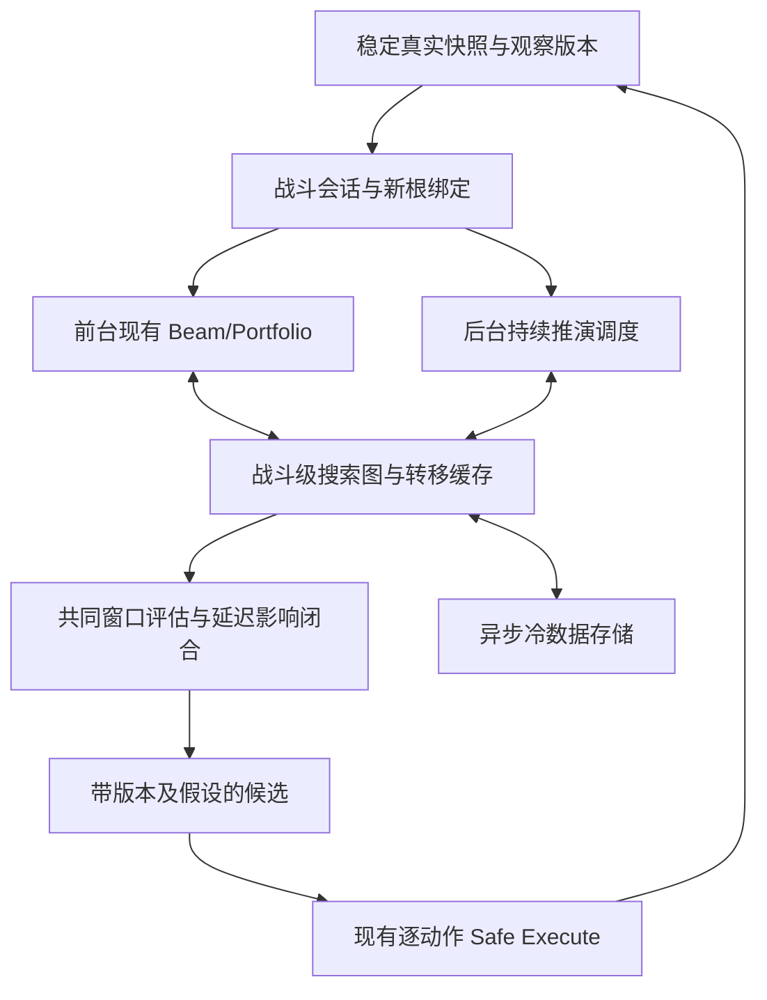

# 当前回合快速决策与持续搜索复用架构

日期：2026-09-27。初次核对基线：`7dd49ba6a26d7f5bfbf4b286f853c1580677f023`；提交前已接入并定向核对远端新增的 `d745b0018e27f2013f7df580bde99523f1ec12ed`。仓库：[CombatSolver](https://github.com/xwr20070408-cloud/CombatSolver)。

性质：面向 GPT 的设计与实施任务书，**尚未实现，也没有性能实测结论**。本次只修改文档。本文负责滚动时域与跨请求复用设计；当前生产事实仍以源码为准，既有质量问题继续由 [质量优先计划](CombatSolver_Quality_First_Next.md) 管理，不复制历史阶段状态。

## 1. 推荐方案

采用 **滚动时域决策 + 延迟影响闭合 + 战斗级持久搜索图 + 新根增量修复 + 后台持续推演**。

前台尽快给出当前回合可采用的路线，评估至少覆盖下一回合本地行动及其后的敌方结算；后台继续拓宽候选、解决延迟副作用、预计算可能出现的新根。真实状态变化时先重新定根、验证和修复，只重算受到影响的部分。未来路线是有条件预测，逐动作执行仍由现有 Safe Execute 校验。

这比“每次搜完整场再执行”更适合队友不断改变局面的多人战斗，也比“只算当前回合伤害”更能避免透支未来。不能保证所有目标同时最优：未知队友行为、指数分支和未建模语义不会因内存增加而消失。可追求的是**更早获得可用决策、保持既有质量保障、尽量保存已经付出的计算**。

这里“算完当前回合”指已形成并通过适用质量门槛的当前回合动作建议，不等于穷尽所有可能路线或证明全局最优。初版沿用生产采用门槛；允许有限时域非胜利路线进入正式采用，是单独行为变更，必须经质量对照和明确批准。

## 2. 现有实现与真正缺口

| 已核对入口 | 当前事实 | 本方案如何接续 |
|---|---|---|
| `src/Search/CombatBeamSolver.CrossTurnPlanning.cs` | 已有跨回合 probe、stand-pat 基线与语义变化保留 | 扩展为延迟影响闭合，不重写为纯单回合搜索 |
| `src/Search/CombatBeamSolver.Transpositions.cs` | StateKey 之外保留药水、累计战损、团队状态等 Pareto 标签 | 将状态、路径标签、评估上下文分开，不能只缓存一个最高分 |
| `src/Search/StateFingerprint.cs`、`CombatBeamSolver.StateEvaluation.cs` | 已有双 64 位状态指纹及牌/牌堆指纹复用 | 审计覆盖后复用；哈希命中还需语义相等校验 |
| `src/Runtime/SolverController.MultiplayerPlanRefresh.cs` | 有限候选重放：3 候选、2 动作前缀、192 节点、60ms 等现行边界 | 当前刷新可保留；长期图修复不能冒充已存在能力 |
| `src/Search/CombatSearchCoordinator.cs` | 已接入 continuation seed 的独立 incumbent probe | 先扩大成果存活范围，保留新根重放与准入边界 |
| `src/Runtime/SolvedRouteCache.cs` | 已有 value-only 磁盘路线缓存、版本/策略身份与容量上限 | 是路线缓存，不是可复用全部搜索边的持久图 |
| `src/Search/SolverSearchProfile.cs` | 统一 Beam、节点、分支和时间配置 | 增加内部调度职责，保持现有预算与并发保障 |

当前交接还区分默认 local-single-core 与实验队友预测栈。本方案不能借优化之名默认开启实验栈，也不能绕过多人专属牌、药水和部署权限限制。默认模式也能从本地副作用评估与新根复用中获益；队友情景预计算仅在该模式已获授权时运行。

远端新增提交已为 local-core 跨回合续用加入条件性“敌人仍存活且只掉血”兼容分支，由斩杀重算设置/窗口控制，入口在 `SolverController.SearchLifecycle.cs` 与 `MultiplayerLocalCrossTurnContracts.cs`。这属于已有策略性容忍，不是完整语义相等；本方案 R0 精确缓存不能直接把该兼容判断当命中证明。后续 A/D 阶段应保留其独立分类并验证阈值变化的决策质量，不重复实现，也不在本次文档任务修改行为。

缺口不是简单“搜索太浅”，而是：搜索成果主要依附一次请求；真实状态改变后可复用证据较少；短期决策与长程探索尚需解耦；跨时域候选缺少统一的延迟负债与可比性合同。

## 3. 看多少回合：按事件闭合，而非固定截断

### 3.1 三种长度分开

| 长度 | 建议起点 | 作用 |
|---|---|---|
| 执行授权长度 | 每次提交一个本地动作，后态核验后再继续 | 防止队友变化使旧动作失效 |
| 前台详细评估窗口 | 当前本地回合 T、下一本地回合 T+1，结算到 T+2 本地行动开始前 | 覆盖当下收益与下一回合的真实代价 |
| 后台推演范围 | 优先 T+2/T+3 的关键事件，必要时延长或到终局 | 处理慢收益、晚触发负债，并为之后观察预热 |

以上是待验证的实验起点，不是新的生产回合上限。不得直接删除现有长线候选或削减原节点/时间预算。前台窗口完成后继续使用原搜索能力；后台范围按价值调度，可比通常窗口更远。

多人“结束回合”须指明本地 EndTurn、队友完成、敌方行动、下一回合触发分别何时发生；本地 EndTurn 不是可直接越过其他玩家的 live 授权。

### 3.2 延迟影响账本

为当前动作造成的未来义务建立 `DeferredImpact` 元数据：来源动作/效果、触发事件、最早/最晚触发边界、受影响资源、状态依赖、结算状态、估计区间及证据等级。该账本引用模拟状态里的真实效果，**不另造一套卡牌规则或再次扣血**。

重点覆盖：下一回合少能量/少抽牌、临时力量回收、易伤/虚弱持续时间、延迟自伤、牌堆污染、消耗关键牌、保留/抽牌顺序变化，以及持续能力的后续收益。

候选到达窗口末端后：

1. 由精确模拟确认已结算的影响退出账本。
2. 未结算但可能改变当前选择的影响，优先延长到相应事件并计算后果。
3. 无法继续的影响保留区间或 Unknown，不得按零代价处理。
4. 不只检查负效应，慢收益也要保留，否则会系统性拒绝铺垫牌。
5. 牌堆污染等跨很多回合的影响不能要求永远“全部结清”；用尾部估值、区间与定向 rollout 表示残余影响，明确不是精确终局。

示例（合成语义，不声称对应某张实际卡）：A 当前多打 12 伤害，但下一回合少 2 能量，导致多承受 18 伤害；B 当前少打 12 伤害，下一回合能完成防御。只按当前伤害排序会偏向 A，覆盖下一行动与敌方结算才可能正确识别 B。敌人已在当前回合全部死亡时，不再扣不存在的战斗内下一回合成本；战后仍持续的成本按原长期策略处理。

### 3.3 可比较的评分

对同一观察、同一情景与同一结算边界，记录：

`Outcome_H = (存活, 累计战损, 剩余HP, 敌人状态, 药水/资源成本, 已实现长期收益, 未结算影响, Coverage)`。

解释性标量可写成 `J_H = Σ已模拟成本 + V_tail(s_H, 未结算影响)`，但生产排序优先沿用既有目标向量及资源政策，不把所有指标随意加权。下一回合确定的负债不因折扣而缩小；不使用很小的 gamma 掩盖后续损失。尾部项只描述窗口外部分，禁止与已模拟伤害/效果重复计数。

不同深度的候选先补齐共同的关键事件边界再比较；不能拿 A 的一回合战损与 B 的三回合战损直接排序。未完成、未知效果、搜索耗尽、失败和真实死亡必须分别表示。

若成本区间有严格依据，满足 `U(best) < min L(other)` 时可证明在当前已覆盖候选/情景范围内胜出；启发式区间不提供该证明。Beam 已剪掉的路线不在证明范围内。连续多轮第一动作不变只能作为稳定性信号，不能写成最优性证书。

### 3.4 自动延长与停止前台等待

优先延长：尚未结算的高影响负债、可能致死边界、第一动作竞争接近、准备牌收益未显现、抽洗牌或怪物阶段转换。

优先后台计算：不影响近期第一动作的远期细节、依赖多次队友假设的长路线、尚未观察到的低优先级情景。未来分支再多也不能阻塞已通过既有准入的当前建议发布。

前台可以在正式可采用候选出现后结束等待，后台继续优化；若没有合格候选就保持“计算中/边界未解决”，不能为响应速度伪造安全结论。首个合格当前回合结果 1–2 秒、温缓存刷新 100–300ms 可作为实验目标，必须报告 p50/p95 与硬件，不是本次保证。

## 4. 持久搜索图架构



### 4.1 所有权与数据结构

组件名是职责建议，实施时优先扩展同职责现有类。

| 建议职责 | 所属层 | 持有内容 |
|---|---|---|
| `CombatPlanningSession` | Runtime | 战斗身份、根 epoch、当前请求、战斗级缓存生命周期 |
| `SearchGraphStore` | Search | 不可变状态、转移边、反向依赖、各上下文 frontier |
| `TransitionMemo` | Search/Engine 边界 | 精确输入及动作到精确输出的确定性结果 |
| `HorizonController` | Search | 共同评估窗口、延迟事件和加深优先级 |
| `DeferredImpact` | Prediction/Search | 从真实模拟效果导出的残余影响及证据 |
| `IncrementalReconciler` | Runtime 编排、Search 修复 | 新根匹配、重放、脏评估传播与候选再选 |
| `PonderScheduler` | Search | 前台/后台任务、去重、取消及结果发布 |
| 冷存储适配 | Runtime 基础设施 | 纯值编码、索引、校验、版本和异步 I/O |

状态节点不持有 live Godot/游戏对象；不可变页和 COW 分支通过现有 Fork/remap 合同隔离。Worker 的临时可写模拟器私有，缓存只发布完成后的纯值结果。现有不能可靠序列化的模拟内容先不进入磁盘层。

图中允许回路，不能假设是 DAG。重复语义状态仍可能有不同累计损失、动作数、目标额度和历史；路径标签保持 Pareto 多样性。零成本循环使用既有进展/循环语义，禁止靠“访问过一次”直接剪掉所有回访。

### 4.2 四类键

1. `DynamicsKey`：未来转移所需完整语义，包括本地状态、可建模远端公开状态、敌人/意图、牌实例与牌堆顺序、RNG 流位置、回合/阶段、持续效果、触发器与相关历史。纳入游戏/Mod/模拟语义版本和知识边界。观察不到的内容标未知，不能编造精确键。
2. `TransitionKey`：DynamicsKey + 动作实例/目标/Choice + 环境动作/事件顺序/随机结果；环境转移不是只有本地出牌。涉及隐藏随机性时存条件分支或分布及模型版本，不能存成一个必然结果。
3. `EvaluationKey`：DynamicsKey + 目标/策略版本 + 情景集合 + 时域/覆盖 + 根归一化参数 + 路径标签。累计战损、已用药水及额度等不能因 re-root 归零；能与后缀成本安全拆分时才独立复用。
4. `ObservationEpoch`：控制部署新鲜度、异步任务归属，与缓存语义等价键分开。

指纹只用于索引，命中后核对规范化语义内容。不能使用对象地址或进程内随机 hash 作为跨运行身份。缓存精确转移不代表旧评分、旧根授权或“已搜索最优”可直接复用。

### 4.3 按安全强度分层复用

| 级别 | 条件 | 可复用内容 | 必须重做 |
|---|---|---|---|
| R0 精确状态 | 版本、完整语义、动作条件均一致 | 已验证转移、可恢复 frontier、后缀候选 | 根相关标签/目标重新绑定，部署新鲜度 |
| R1 新根路线重放 | 状态不同，旧动作可能仍有价值 | 动作序列/排序提示 | 从新根模拟、共同窗口评价、质量与部署准入 |
| R2 依赖证明 | 改变字段与纯函数完整依赖闭包无交集 | 局部纯计算结果 | 受影响结果与所有反向祖先评价 |
| R3 近似相似 | 只有相似牌组/局面 | 搜索顺序、宏动作提案、尾部估计先验 | 全部语义与合法性验证，不作剪枝或执行证明 |

默认先落地 R0/R1。R2 要覆盖间接 Hook、阈值、RNG 和事件次序依赖；“只变了一点敌人 HP”不足以证明无影响，可能刚好跨越斩杀阈值。不能将旧状态的 delta 简单贴到新状态上。

新真实状态在图中不存在时，为它建立新根；其他状态节点继续作为内容寻址缓存存在，不把不相等的旧根强行改名为新根。整树 re-root 是精确匹配的一种优化，不是所有队友变化的通解。

### 4.4 跨请求恢复与增量回传

搜索暂停点保存未展开 frontier、已枚举动作游标、所属 portfolio 成员/策略、深度和路径标签。`FullyExpanded` 必须绑定动作生成器版本、分支覆盖和环境情景；被 Beam 丢弃不等于已证明无价值。

新根到达后先精确查找，再重放已有少量优质候选，最后将未覆盖部分交给正常搜索。状态转移缓存共享，不同目标/情景的分数和完成标志隔离。改变子节点评估时，通过反向边标记祖先结果 stale，按需重新回传；循环区域使用明确的有限时域或现有循环语义，不能套用无环递归。

已有 frontier 若预算耗尽，记录暂停原因与完成程度；同一根可继续扩展，不能把“上次 Beam 没留下”当成永久闭合证明。

## 5. 队友不确定性与持续预测

不要押注一条长路线。保存少量可解释的条件策略：本地第一动作/短前缀相同，未来在**可观察分歧**之后分支，例如敌人是否被击杀、队友是否施加易伤、资源是否改变。相同观察历史下必须选相同动作，禁止每个未来情景偷看答案后选择不同第一动作。

默认本地核心可先预热预测中的本地后态和下一回合根；实验队友模型开启时，再预热名义配合、暂时不行动、目标提前死亡、关键增减益等情景。情景权重没有实测校准时只是压力覆盖，不称胜率或概率期望。保留现有 Robust 作为对照，不在缓存改造时顺便换风险偏好。

后台任务优先级可用“预计能改变当前选择的程度 × 可能被复用的程度 / 预计代价”排序；缺少概率时用序数等级，避免虚假精度。优先顺序：当前根关键竞争与负债 → 近期可能的新根 → 次优当前动作备选 → 更远期探索。后台也应拓宽，不是只把赢家一路延长。

并发实现使用现有 worker 能力，并在 detached 状态上运行；保留前台既有容量，后台消费额外可用资源，不缩减当前预算/并发。共享转移使用 single-flight 去重；不同 portfolio 的质量标签独立。任务按观察 epoch 发布：旧 worker 可以完成并写入语义合法缓存，但不能覆盖新根结果或恢复过期执行会话。

前台取消与战斗缓存销毁分开：新观察取消旧根发布资格，仍保留已完成纯值成果；用户停止、战斗退出、版本切换各自有明确生命周期。计划更新不得改变已经在途的原生动作，等待稳定后再接续。

## 6. 内存和 SSD 怎么用

资源宽裕时优先保留**可复用状态和转移**，而非无限保留完整对象树。

| 层 | 内容 | 策略 |
|---|---|---|
| 热 RAM | 当前根、近期后态、竞争路线、frontier | 不可变紧凑页、COW、分片索引；先测量再决定布局 |
| 温 RAM | 本场其余精确节点、已完成转移、评估标签 | 状态去重、共享牌堆/效果页，避免每节点完整克隆 |
| 冷 SSD | 可序列化的精确转移、状态页、版本化检查点 | 内容寻址块 + 索引、后台批写、校验和、原子完成标记 |
| 长期先验 | 常见动作组合、离线尾部估值样本 | 只引导候选，跨版本失效，不冒充精确状态命中 |

存储技术在测得对象大小、命中率和 I/O 后再选；首版可使用分段块文件与简单索引，不先引入数据库/GPU依赖。磁盘读写不处于逐动作提交的同步关键路径，主搜索不等待冷盘才开始找解。损坏/版本不符条目隔离并计数，按照明确设计作为缓存未命中，不改变求解语义。

即便愿意无限给内存，物理 RAM、带宽、GC、地址空间和磁盘仍有限，保留现有保护。容量估算：若平均状态+边+索引摊销 2KiB，1000 万项约 19GiB、1 亿项约 191GiB；这只是量级例子，需实测共享率和对象开销。禁止直接无界 `Dictionary<State, FullSimulator>`。

冷数据按版本与战斗分区；生命周期配置只管理本项目自己创建的缓存，不清理存档、游戏或其他缓存。内存/SSD失败不得导致错误建议；尚未缓存的数据仍可由原模拟器计算。大规模长期数据是否值得保留，取决于跨根实际命中和节省的模拟时间，而不是缓存体积。

GPU、学习型价值网络和 MCTS 可作为以后独立实验：现有 C# 规则/对象模拟不能直接搬到 GPU；学习器初期只排序和估计尾部，不作安全证明；MCTS 不是前置条件，先让现有 Beam 具备复用能力。不要同时换引擎、搜索器、目标函数和执行器。

## 7. GPT 分阶段执行卡

每次一个阶段、一个主要语义边界。阶段名不是必须创建的类。实施前核对当前源码与已有结果，禁止重复施工。当前任务只批准生成此文档；下列代码变更按后续明确任务推进，用户可见行为单独确认。

| 阶段 | GPT 要完成的修改 | 最小验收 | 依赖/回滚 |
|---|---|---|---|
| A 现状与测量 | 沿当前调用链确认候选发布时间、重搜原因、已有复用，扩展现有诊断计数 | 同一输入结果不变；区分冷搜、精确续用、重放 | 起点；仅诊断可独立撤回 |
| B 延迟影响合同 | 扩展跨回合 evidence 与评估元数据，首先覆盖下一回合确定副作用；共同窗口比较 | 延迟负效应、慢收益、当回合斩杀三类不双算、不漏算 | 先旁路对照，排序迁移独立提交 |
| C 战斗级 R0 转移缓存 | 审计键/所有权，抽取纯值转移结果；先只跨同战斗请求复用 | 开/关缓存逐状态和结果一致；RNG/Choice/版本变化不得假命中 | B 可并行概念设计，实施串行；开关可禁用 |
| D 新根恢复 R1 | 保留 frontier/候选，从真实新根精确接入或重放，回传受影响评价 | 精确命中、轻微 drift、斩杀阈值变化各走正确分支 | C；失败只撤缓存采用，原求解仍可用 |
| E 前台/后台分离 | 先发布已获准当前建议，后台恢复探索；引入时域/负债调度 | 旧 epoch 不发布、不部署；前台质量门槛不降低 | B–D；保留原完整搜索对照 |
| F 情景预热 | 在已启用实验栈内预计算近期可观察分支，保证同观察同动作 | 队友改目标/暂不行动后正确接入或重算 | E；不默认开启实验多人算法 |
| G SSD 冷存储 | 纯值编码、版本命名空间、异步写入/预取、校验与恢复 | 往返语义一致、损坏/旧版本不误命中、热路径无同步 I/O | C/D 成熟后；不让磁盘成为必要依赖 |
| H 质量与响应验收 | 固定输入 A/B，再真实 Host/Client 验证；记录收益及未达项 | 质量不被已知对照支配，响应/复用改善可重现 | 前面各阶段；不以合同替代实机 |

建议实施顺序 A → B → C → D → E → F → G → H；先收获正确的短期评价和同战斗复用，再投入昂贵持久化。R2 依赖闭包复用是 D 后的可选独立阶段，未证明可靠时不影响主线交付。

给 GPT 的通用任务模板：

```text
实施 Rolling_Horizon_Reuse_Architecture.md 的阶段 <X>。
先核对当前 HEAD、适用规则及该阶段直接调用链，复用已完成能力。
本轮只处理 <边界>；保留现有预算、并发、质量与执行保护。
列出状态所有权、键/失效条件及最小验证，再修改。
每次测试默认不超过10项；扩大范围先征得同意。
不使用子智能体；不启动游戏GUI代用户操作。
完成后报告：改变行为、未覆盖边界、实际验证、提交与推送状态。
临时产物仅放项目 .local；只清理本任务创建的内容。
```

GPT 负责代码、精确合同、构建与允许的 pinned 回放、诊断分析、提交推送。用户负责目标冲突的产品决策，以及真实多人窗口中的建房、出牌和观察。需要实机时 GPT 先完成技术准备，每次只请求用户执行当前一步；不把部署和日志分析反交用户。

## 8. 验收设计与成功标准

以下是后续阶段的测试设计，**本次未执行**。每个测试批次最多 10 项，按改变边界选最小子集；不能把多个大矩阵包装为一个测试规避限制。

推荐一个最多 8 场的固定质量集：普通攻防、下一回合资源负债、慢收益准备、抽洗牌/Choice、当前斩杀免除后债、队友击杀目标、队友增减益改变价值、状态近似但 RNG 不同。语义场景须基于实际支持效果构造，不能只用合成评分函数证明真实质量。

缓存正确性另按阶段选窄合同：完整键碰撞校验、Fork 隔离、过期 worker、路径标签不丢失、磁盘往返/损坏；超过本轮10项先申请。源代码变化才构建/跑对应检查，纯文档只查链接与 diff。

| 指标 | 记录方式与判定 |
|---|---|
| 首次可用时间 | 稳定根捕获 → 通过适用准入且成功发布，不能用未经评价的首候选冒充 |
| 刷新时间 | 新根稳定 → 新 epoch 合格路线，报告 p50/p95 与分原因样本数 |
| 精确复用率 | 经语义校验的缓存命中 / 可缓存转移请求；重放提示与近似命中另记 |
| 节省工作量 | A/B 的实际模拟转移差及耗时；不能只报总命中数 |
| 后台有效率 | 被后续新根采用的后台成果 / 后台工作，同时记录无用推演成本 |
| 决策质量 | 存活、累计损失、最终HP、回合、资源逐维比较，不用单一分数掩盖退化 |
| 预测正确性 | 同输入 actual/simulated、缓存开关逐状态差分；未知独立标记 |
| 抖动与陈旧 | 同根推荐更换次数、过期发布/误执行必须为0 |
| 内存与磁盘 | 峰值、GC停顿、字节/唯一状态、I/O等待、跨根实际命中 |

做两类 A/B：固定工作量看算法质量，固定墙钟看用户响应。不得通过减少节点、Beam、情景、并发或检查取得“加速”；记录总工作与前后台分摊。缓存开关对照固定调度和输入时应语义一致；并发调度变动引起的路线差异必须能解释，且做同目标质量比较。

不要承诺绝对命中率或固定倍数。若先验命中低，先分析根差异和键覆盖，不能放松等价性条件；若深搜没有改善当前选择，调整后台优先级，不削减生产保障。效果不足则保持实验状态，不宣布目标完成。

## 9. 理论依据及适用边界

- [D* Lite，Koenig 与 Likhachev，2002](https://www.cs.cmu.edu/afs/cs/Web/People/motionplanning/papers/sbp_papers/integrated3/koenig_dstarlite_aaai02b.pdf)：增量规划复用先前计算。本文借鉴“变化后修复受影响部分”，但战斗是带随机、路径目标和动态分支的图，不能直接套其最短路保证。
- [Monte Carlo Tree Search in the Presence of Transition Uncertainty，AAAI 2024](https://ojs.aaai.org/index.php/AAAI/article/view/29994)：讨论转移模型不确定性。用于提醒区分模拟器确定性与队友环境不确定性，不构成迁移 MCTS 的性能证据。
- [A Local Monte Carlo Tree Search Approach in Deterministic Planning，AAAI 2011](https://ojs.aaai.org/index.php/AAAI/article/view/8039)：作为后续局部探索研究入口，不能替代本项目 Beam 基线对照。

本文具体窗口、数据结构、阶段划分与时延目标是针对当前仓库的工程建议，不是上述论文对本游戏的结论。最优先落地的是 **延迟负债不能漏算、精确成果跨请求保留、真实新根重新授权**；磁盘和更多计算资源用于扩大可靠成果复用。
